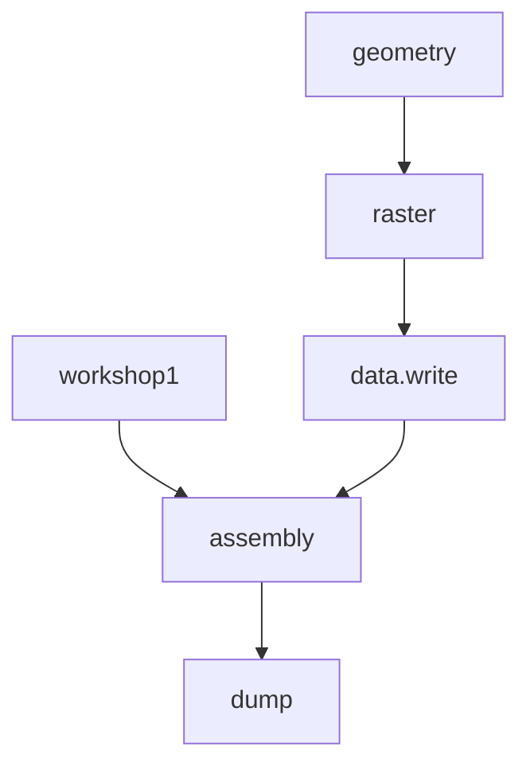
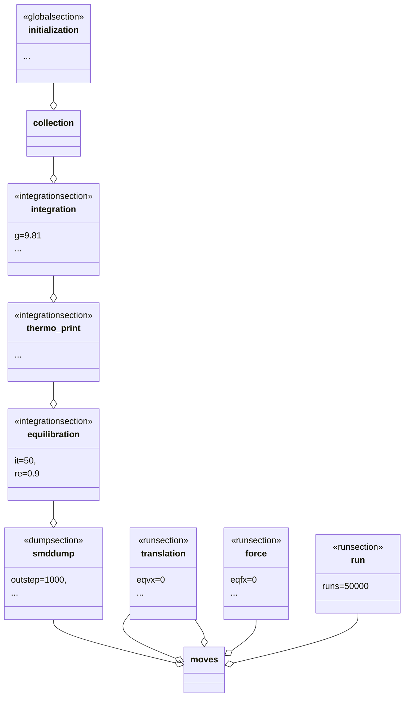
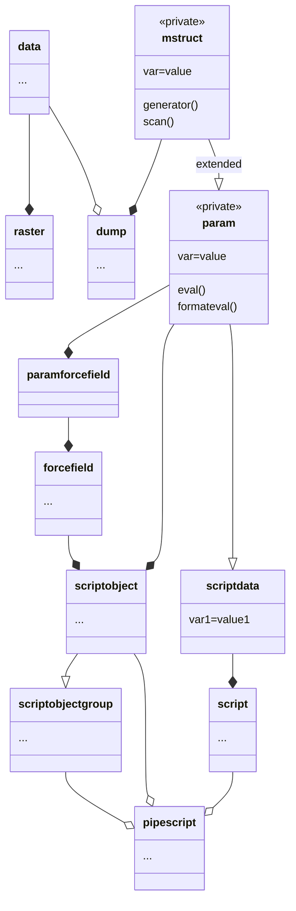
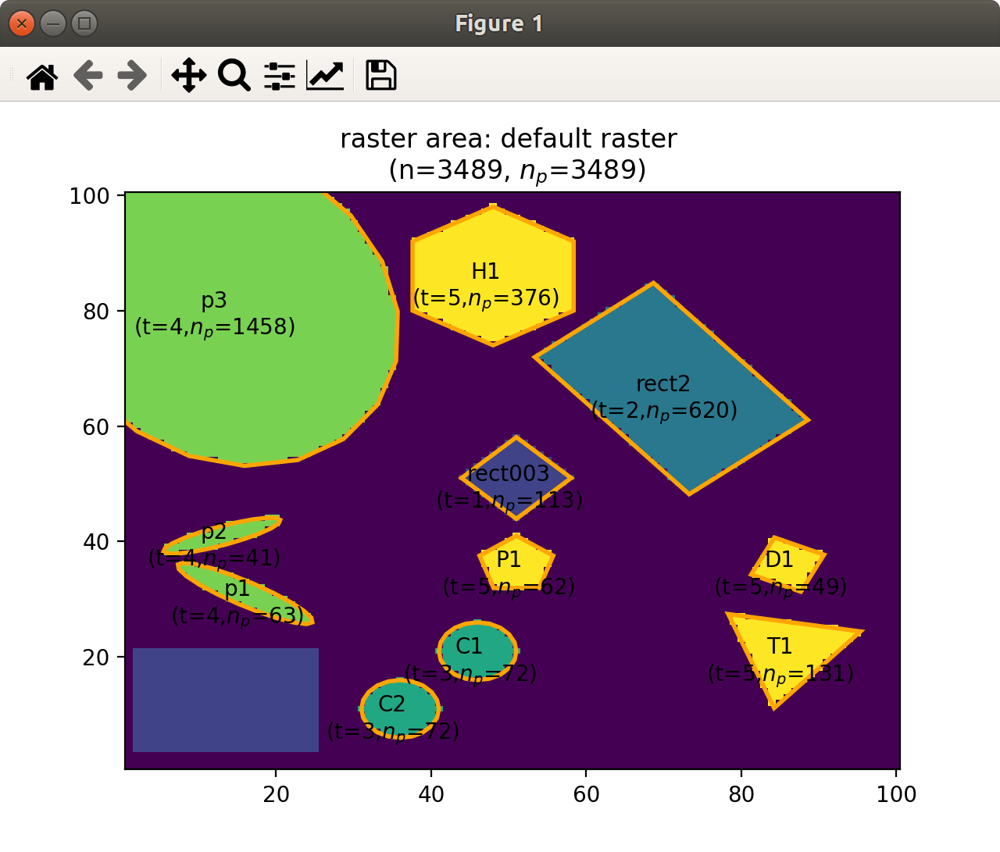
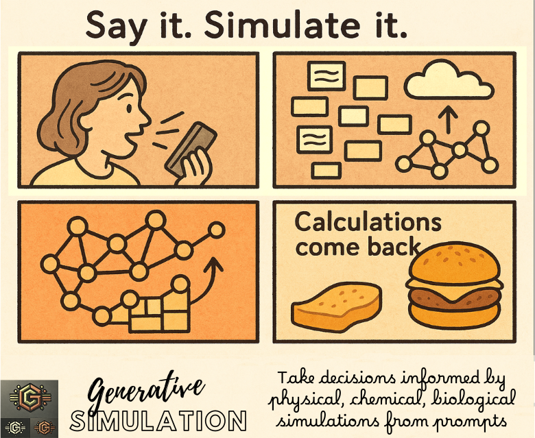

# 🍕 **Pizza³**

<div align="center">

|  | This project is part of the <br />[Generative Simulation](https://github.com/ovitrac/generativeSimulation) demonstrators | Say it.<br />Simulate it with AI. |
| ----------------------------------------- | ------------------------------------------------------------ | --------------------------------- |

</div>


---

<a href="https://deepwiki.com/ovitrac/Pizza3" title="Detailed manual of Pizza3" target="_blank">

  <picture>
    <source media="(prefers-color-scheme: dark)"
            srcset="https://img.shields.io/badge/DeepWiki-Pizza3-1f6feb?style=flat&logo=bookstack&logoColor=white&labelColor=0d1117">
    <source media="(prefers-color-scheme: light)"
            srcset="https://img.shields.io/badge/DeepWiki-Pizza3-0969da?style=flat&logo=bookstack&logoColor=white&labelColor=f6f8fa">
    
  </picture>

</a>

> 
>
> **Toolkit for multiscale modeling with LAMMPS in Python 3.x**. It integrates with [LAMMPS-GUI](https://github.com/lammps/lammps/releases) and leverages Large Language Models for rapid prototyping.

---

- 📄 **[Read this file in `HTML`](https://htmlpreview.github.io/?https://raw.githubusercontent.com/ovitrac/Pizza3/main/README.html)** *(includes 🎬 videos and enhanced visuals).*
- 📚 **[Online Documentation - 🐍Python](https://ovitrac.github.io/Pizza3/)** *(including how to  🛠️ install, ▶️ run and ✏️ modify <kbd>Pizza³</kbd>)*
- 📚 **[Online Documentation - 📊Matlab/Octave](https://ovitrac.github.io/Pizza3/index_matlab.html)** *(advanced 📈📉 post-treatment)*
- 📐[POST Examples and Analysis Workflow](https://ovitrac.github.io/Pizza3/post/index_post.html) *(examples of 🌊 fluid-structure interactions)*
- 🔖 **[Releases](https://github.com/ovitrac/Pizza3/releases)** *(✨ new capabilities are detailed there, ⬇️ download page)*
- 🧵[Wiki Pages](https://github.com/ovitrac/Pizza3/wiki) *(🤺 technical discussions)* including on 🔢 [codelet data containers](https://ovitrac.github.io/Pizza3/pizza/private/param_demo.html))
- 🗃️ [DeepWiki Pages](https://deepwiki.com/ovitrac/Pizza3) *(the full manual of Pizza^3^ prepared by 🧠 AI)*
- 📰[Publication](https://doi.org/10.1016/j.foodres.2024.114908)


---


## 🧠 **Part I: Overview**

<kbd>Pizza3</kbd> began as a fork and extension of the **Pizza.py** toolkit for [LAMMPS](https://www.lammps.org/), rewritten in Python 3.x to modernize the original Python 2.x framework. Over time, it has evolved into a **flexible and loosely integrated toolkit** designed for [LAMMPS](https://www.lammps.org/) users, regardless of the simulation style. <kbd>Pizza3</kbd> empowers users to facilitate **multiscale modeling** and seamlessly connect results across different scales and levels of coarse-graining.

All objects in <kbd>Pizza3</kbd> have **scripting and static compiling capabilities**, and can be converted into [LAMMPS](https://www.lammps.org/) instructions through mathematical operators (e.g., `+`, `|`, `*`) or by calling methods like <kbd>script()</kbd> or <kbd>do()</kbd>. This design philosophy ensures that complex workflows remain accessible, flexible, and modular.

> **Work in Progress:** The toolkit evolves regularly. **Come back often** for improved capabilities. Newer versions add more classes, dynamic scripting (`pizza.dscript()`, `pizza.dforcefield()`), and better integration with large language models via intermediate `DSCRIPT SAVE FILE` formats.

### 📌 **Key Features:**

- 🛠️ **Fully object-oriented architecture**
- 🌐 **Compatibility with modern Python standards**
- 📦 **Extensible classes for custom workflows**
- 🎯 **Focus on multiscale and multiphysics modeling**
- 🚀 **Advanced 2D/3D design capabilities**

### 📌 **Key Components:**

- 🌟 **Design reusable templates** with scripting classes like `pizza.script()`, `pizza.dscript()`, `pizza.forcefield()`, `pizza.dforcefield()`, `pizza.group()`.
- 🚀 **Dynamic design of complex 2D and 3D shapes** with `pizza.raster()`, `pizza.region()`.
- 🧩 **Combine simulation components** via mathematical operators (`+`, `|`, `*`,`&`).
- 📜 **Generate input/output scripts and dumps** using classes like `pizza.data()` and `pizza.dump()`.
- 🔬 **Perform advanced spatial/temporal analysis** using the MATLAB/Octave-based library in the `post/` folder.


---

<details>

<summary>Workshops and Examples (click to expand)</summary>

## 🏗️ **Part II: Illustrations** (Workshops and Examples)


### 🎓Scope

Our main goal is to achieve a set of tools that **facilitate multiscale modeling** in [LAMMPS](https://www.lammps.org/): connecting results across scales with different levels of detail. Below we highlight the current achievements and show how <kbd>Pizza3</kbd> integrates with [LAMMPS](https://www.lammps.org/).

**In the latest versions of <kbd>Pizza3</kbd>:**  
- 🚀 **Almost all 3D design capabilities** of [LAMMPS](https://www.lammps.org/) have been implemented, particularly via new classes like `pizza.region()` and `pizza.group()`.
- 🧪 **2D algorithms** can be tested via `pizza.raster()` at lower computational cost without losing generality.

> The class <kbd>pizza.script()</kbd> is central for coding [LAMMPS](https://www.lammps.org/) instructions from Python "codelets" and handling `TEMPLATES`. Dynamic scripting concepts via `pizza.dscript()` and `pizza.dforcefield()` make it easy to transform existing [LAMMPS](https://www.lammps.org/) code into reusable templates.

**I/O Management:**  
`pizza.data()` and `pizza.dump()` objects streamline frame manipulation, output-to-input conversions (like restart files), and advanced spatial/temporal analysis.

**Forcefields:**  
Forcefields can be managed through inheritance, and a user library can be built by overriding existing definitions. It's recommended to implement user rules with <kbd>pizza.generic()</kbd> or <kbd>pizza.dforcefield()</kbd>.

**Visualization and Post-Processing:**  
Some examples of visualization are proposed in 2D and 3D in Python. The `post/` folder includes advanced analysis tools integrated with MATLAB/Octave. Users are encouraged to combine [LAMMPS-GUI](https://github.com/lammps/lammps/releases) with [OVITO](https://www.ovito.org/) for rapid prototyping.

**Integration with Large Language Models:**  
The `DSCRIPT SAVE FILE` format has been designed for AI text generators and facilitating the maintenance of a large library of codelets. The use of this new text format or language is not mandatory, but it enables code generation with almost zero Python.


---


### 📊Table 1: Overview of Legacy Classes

| Workshops<br>(workable demos) |             **Main classes<br/>and subclasses**              |                    Low-level<br/> classes                    |
| :---------------------------: | :----------------------------------------------------------: | :----------------------------------------------------------: |
|     class: ==workshop1==      |               2D drawing class: `pizza.raster`               | generic struct class à la Matlab: `pizza.private.mstruct()`  |
|     class: ==workshop2==      | as above (with advanced features: time-steps, region of interest, salting) |                           as above                           |
|       script: geometry        |     class to read/write input files: `pizza.data3.data`      | self-evaluable struct with scripting/alias: `pizza.private.param()` |
|       script: assembly        |            manage dump files: `pizza.dump3.dump`             |                                                              |
|                               | advanced scripting: `pizza.script.script`, `pizza.script.datascript`, `pizza.script.scriptobject`, `pizza.script.scriptobjectgroup`, `pizza.script.pipescript` |                                                              |
|                               | forcefields: `pizza.forcefield.forcefield`, `pizza.forcefield.smd`, `pizza.forcefield.tlsph`, `pizza.forcefield.ulsph`, `pizza.forcefield.none`, `pizza.forcefield.water`, `pizza.forcefield.solidfood`, `pizza.forcefield.rigidwall` |                                                              |

---

### 📐Key Steps

**Workshop1** illustrates the main steps to design, run, and analyze a  [LAMMPS](https://www.lammps.org/) project from Python 3.x.



---

### 📝Overview of workshop1 Classes

Workshop1 involves 7 main steps and codes, as shown below:

```python
# initizalization of the scheme 
bead_kernel_radius = 0.0015
init = initialization(neighbor =[bead_kernel_radius,"bin"])
    
# scriptobject handles bead interactions
FLUID = scriptdata(
        rho = 1000,
        c0 = 100.0,
        q1 = 1.0,
        contact_stiffness = 10000000
    )    
SOLID = scriptdata(
        rho = 2000,
        c0 = 200.0,
        sigma_yield = '0.1*${E}',
        contact_stiffness = 10000000
    )
WALL = scriptdata(
        rho = 3000,
        c0 = 200.0,
        contact_stiffness = 10000000,
        contact_scale = 1.5
    )
b1 = scriptobject(name="bead 1",
                  group = ["rigid", "solid"],
                  filename='./raster_2_types.lmp',
                  forcefield=rigidwall(USER=WALL))
b2 = scriptobject(name="bead 2",
                  group = ["fluid", "ulsph"],
                  filename = './raster_2_types.lmp',
                  forcefield=water(USER=FLUID))
b3 = scriptobject(name="bead 3",
                  group = ["oscillating", "solid","tlsph"],
                  filename = './raster_4_types.lmp',
                  forcefield=solidfood(USER=SOLID))
b4 = scriptobject(name="bead 4",
                  group = ["solid", "tlsph"],
                  filename = './raster_4_types.lmp',
                  forcefield=solidfood(USER=SOLID))

inte = integration()
thermo = thermo_print()
equilsteps = equilibration(it=15)
dmp = smddump(outstep=2000,outputfile=["dump.workshop1"],)
moves = translation(vx = ["0.1*exp(-step/100)"],
                        vy = ["0"],vz = ["0"]) & \
        run() & \
        translation() & \
        force() & \
        run()

collection = b1+b2+b3+b4
fullscript = init + collection.script + inte + thermo + equilsteps + dmp + moves
fullscript.write("./tmp/in.swimmingpool")
```


Equivalent flowchart:



---


### 🧩Top Classes Dependencies



---


### 🏞️ Output of workshop1 (LAMMPS script)

### 📜LAMMPS script

```perl
# Automatic LAMMPS script (version 0.4)
# olivi@LX-Olivier2021:/home/olivi/billy/python
# ven. 18 mars 2022 19:33:50 

 

# INRAE\SAYFOOD\olivier.vitrac@agroparistech.fr
# INRAE\SAYFOOD\william.jenkinson@agroparistech.fr


#   Scheme initialization
units       si
dimension	2 
boundary    p f p         # f = fixed, p = periodic
comm_modify vel yes
comm_style  tiled
atom_modify map array
newton off
neighbor	0.0015 bin            # search radius for neighbor list (=kernel radius)
neigh_modify    every 5 delay 0 check yes

atom_style	smd
 

# ===== [ BEGIN INPUT FILES SECTION ] ===============================================================================

# load files for objects: bead 1, bead 2
	read_data ./raster_2_types.lmp

# load files for objects: bead 3, bead 4
	read_data ./raster_4_types.lmp add append

# ===== [ END INPUT FILES SECTION ] =================================================================================


# ===== [ BEGIN GROUP SECTION ] =====================================================================================

	#	Definition of group 1:rigid
	#	=bead 1
	#	Similar groups: rigid, solid
	group 	 rigid 	type 	 1

	#	Definition of group 2:solid
	#	=bead 1, bead 3, bead 4
	#	Similar groups: rigid, solid, oscillating, tlsph
	group 	 solid 	type 	 1 3 4

	#	Definition of group 3:fluid
	#	=bead 2
	#	Similar groups: fluid, ulsph
	group 	 fluid 	type 	 2

	#	Definition of group 4:ulsph
	#	=bead 2
	#	Similar groups: fluid, ulsph
	group 	 ulsph 	type 	 2

	#	Definition of group 5:oscillating
	#	=bead 3
	#	Similar groups: oscillating, solid, tlsph
	group 	 oscillating 	type 	 3

	#	Definition of group 6:tlsph
	#	=bead 3, bead 4
	#	Similar groups: oscillating, solid, tlsph
	group 	 tlsph 	type 	 3 4

# ===== [ END GROUP SECTION ] =======================================================================================


# ===== [ BEGIN FORCEFIELD SECTION ] ================================================================================
    # [1:bead 1] PAIR STYLE SMD
    pair_style      hybrid/overlay smd/ulsph *DENSITY_CONTINUITY *VELOCITY_GRADIENT *NO_GRADIENT_CORRECTION &
                                   smd/tlsph smd/hertz 1.5
    
    # [1:bead 1 x 1:bead 1] Diagonal pair coefficient tlsph
    pair_coeff      1 1 none
    
    # [2:bead 2 x 2:bead 2] Pair diagonal coefficient ulsph
    pair_coeff      2 2 smd/ulsph *COMMON 1000 100.0 1.0 1.0 0 &
                    *EOS_TAIT 7 &
                    *END
    
    # [3:bead 3 x 3:bead 3] Diagonal pair coefficient tlsph
    pair_coeff      3 3 smd/tlsph *COMMON 2000 400000000.0 0.3 1.0 0.0 10 1.0 &
                    *STRENGTH_LINEAR_PLASTIC 40000000.0 0 &
                    *EOS_LINEAR &
                    *END
    
    # [4:bead 4 x 4:bead 4] Diagonal pair coefficient tlsph
    pair_coeff      4 4 smd/tlsph *COMMON 2000 400000000.0 0.3 1.0 0.0 10 1.0 &
                    *STRENGTH_LINEAR_PLASTIC 40000000.0 0 &
                    *EOS_LINEAR &
                    *END
    
    # [1:bead 1 x 2:bead 2] Off-diagonal pair coefficient (generic)
    pair_coeff      1 2 smd/hertz 10000000
    
    # [1:bead 1 x 3:bead 3] Off-diagonal pair coefficient (generic)
    pair_coeff      1 3 smd/hertz 10000000
    
    # [2:bead 2 x 3:bead 3] Off-diagonal pair coefficient (generic)
    pair_coeff      2 3 smd/hertz 10000000
    
    # [1:bead 1 x 4:bead 4] Off-diagonal pair coefficient (generic)
    pair_coeff      1 4 smd/hertz 10000000
    
    # [2:bead 2 x 4:bead 4] Off-diagonal pair coefficient (generic)
    pair_coeff      2 4 smd/hertz 10000000
    
    # [3:bead 3 x 4:bead 4] Off-diagonal pair coefficient (generic)
    pair_coeff      3 4 smd/hertz 10000000
    
# ===== [ END FORCEFIELD SECTION ] ==================================================================================


#   Gravity
fix             gfix all gravity 9.81 vector 0 1 0
#   Time integration conditions
fix             dtfix fluid smd/adjust_dt 0.1 # dynamically adjust time increment every step
fix             integration_fix_ulsph ulsph smd/integrate_ulsph adjust_radius 1.01 10 15
fix             integration_fix_tlsph tlsph smd/integrate_tlsph
#   balancing
fix             balance_fix all balance 500 0.9 rcb


#   thermodynamic information
thermo		   100
thermo_modify  lost ignore
thermo_style   custom step dt


#   Equilibration
dump            dump_equilibrate all custom 100 dump.equilibrate id type x y z &
                fx fy fz vx vy vz radius
dump_modify     dump_equilibrate first yes

variable vmag atom sqrt(vx^2+vy^2+vz^2)
compute         maxvel all reduce max v_vmag
variable        maxvelre equal 0.6*c_maxvel
run     10000 every 1000 &
    "print ${maxvelre}" &
    "fix             ulsph_equilibration ulsph smd/integrate_ulsph limit_velocity ${maxvelre}" &
    "fix             tlsph_equilibration tlsph smd/integrate_tlsph limit_velocity ${maxvelre}"

dump_modify     dump_equilibrate every 1000000

fix             ulsph_equilibration ulsph smd/integrate_ulsph
fix             tlsph_equilibration tlsph smd/integrate_tlsph


#   Additional computed values
        
#   Compute supp particle data
compute         contact_radius all smd/contact/radius
compute         vol all smd/vol
compute         rho all smd/rho


#   dump command
dump            dump_id all custom 100 dump.workshop1 &
id type x y z mol mass c_rho c_vol radius c_contact_radius &
vx vy vz fx fy fz 
dump_modify     dump_id first yes #every/time 0.001


#   Translation
variable        vx equal 0
variable        vy equal 1
variable        vz equal 0
fix             setvelocities oscillating smd/setvel v_vx v_vy v_vz


#   run section
run 50000


#   Force
variable        fx equal 0/count(all)
variable        fy equal 0/count(all)
variable        fz equal 0/count(all)
fix             setforces all smd/setvel v_fx v_fy v_fz


#   run section
run 50000


```


---

### 🎥 Videos from workshop1

The videos are generated with [ovito](https://www.ovito.org/) directly from dump files.


**Equilibration step**

<video width="50%" controls="controls" preload="auto">
    <source type="video/mp4" src="https://github.com/ovitrac/Pizza3/raw/main/examples/workshop1_equilibration.mp4">
</video>


**Run step**

<video width="50%" controls="controls" preload="auto">
    <source type="video/mp4" src="https://github.com/ovitrac/Pizza3/raw/main/examples/workshop1_run.mp4">
</video>

---


### 📈 Extensions in Workshop2


#### 🎓Scope:  

- Inputs from images
- Time-step and salting
- Squeeze and shear examples

> With workshop 2, more complex systems should be achievable to the user including the use of "*sensing*" surfaces and better control of system parameters such as viscosity.


#### 🛠️New classes and updates

A few classes have been updated/improved to be more usable and funcitonal, and two new classes have been created; file and group. Both these classes give additional methods of creating groups in lammps to suppliment the use of the intereactions class.

##### 🌟workshop2.file

The *file* class can be used to read the files, and it is a new method of creating a group. If you want all the atoms in your file to be part of a group, use the arguments group=True and specify an ID for them with group_name = "your_group_name"

Example:

```PYTHON
files = workshop2.file(file_name=["./file1"],group=True,group_name=["sensor"]) & \
        workshop2.file(file_name=["./file2"],group=True,group_name=["substance"], append = True)
```

N.B. for subsequent files, if you want to preserve the files already uploaded use append=True

##### 🌟workshop2.group

The group class can create new groups from an input of arguments to specify a sub-domain of the simulation. You have four arguments; x = [x1 x2], x = [x1 x2], x = [x1 x2] and groupID="sensor".

Example:

```PYTHON
groups = workshop2.group(groupID = ['bottom'], y=['EDGE',0.2])
```

By default, all spatial arguments are 'EDGE' which means the edge of the domain box.

##### 🌟workshop2.equilibrate

- by default, tlsph object are frozen but using static='yourgroup', an group of atoms can be frozen
- equilibrate is simplified, periodically all velocities in the simulation are set to 0 in order to remove the kinetic energy from the system, it= can be used to specify the number of such cycles

##### 🌟workshop2.translation/force

- bugs in the translation and force classes resolved
- names can be specified case-by-case and multiple actions can be performed


#### 🖼️ Examples


##### **Squeeze Flow** 

A block of fluid is squeezed between two surfaces, the lower surface is "sensing" and detects stresses.


##### **Solid deformations**  


</details>

---

<details>

<summary>Object-Oriented Design (click to expand)</summary>

## 🔗Part III. Overview of Classes used in Workshops


### 🌟pizza.raster()

`pizza.raster()` is a 2D space-filling model for coarse-grained systems. 

```python
from pizza.raster import raster, emulsion, coreshell
```

> Use `pizza.region()` to generate 3D complex objects and set their interactions. They can be generated and visualized with [LAMMPS-GUI](https://github.com/lammps/lammps/releases).  `pizza.group()` applies indifferently to 2D and 3D objects.


#### Basic shapes

The example creates simple objects with different shapes and bead types.



```python
# drawing area
R = raster()
# rectangle shapes
R.rectangle(1,24,2,20,name='rect1')
R.rectangle(60,80,50,81,
            name='rect2',beadtype=2,angle=40)
R.rectangle(50,50,10,10,
                mode="center",angle=45,beadtype=1)
# circules and ellipses
R.circle(45,20,5,name='C1',beadtype=3)
R.circle(35,10,5,name='C2',beadtype=3) R.circle(15,30,10,
 name='p1',beadtype=4,shaperatio=0.2,angle=-30)
R.circle(12,40,8,
 name='p2',beadtype=4,shaperatio=0.2,angle=20)   R.circle(12,80,22,name='p3',beadtype=4,shaperatio=1.3,angle=20)
# other polygons
R.triangle(85,20,10,name='T1',beadtype=5,angle=20)
R.diamond(85,35,5,name='D1',beadtype=5,angle=20)
R.pentagon(50,35,5,name='P1',beadtype=5,angle=90)
R.hexagon(47,85,12,name='H1',beadtype=5,angle=90)
# labels and first plot
R.label("rect003")
R.plot()
R.list()
R.show()
# refresh with all labels except one
R.clear()
R.plot()
R.show(extra="label")
R.label("rect003")
R.unlabel('rect1')
# generate and write the corresponding pizza.data() object
X=R.data()
X.write("tmp/example.lmp") # scaling is available
```


#### Duplicate and replicate objects along a path

Geometry objects can be copied between `pizza.raster()` objects and copied along arbitrary paths or coordinates.


```python
# source
draft = raster()
draft.rectangle(1,24,2,20,name='rect1'),
draft.circle(10,10,2,name="X",beadtype=4)
# copy an entire raster to the collection "C1"
A = raster()
A.collection(draft,name="C1",beadtype=1,translate=[10,30])
# copy along a path "PX"
B = raster()
B.copyalongpath(draft.X,name="PX",beadtype=2,
                    path=arc,
                     xmin=10,
                     ymin=10,
                     xmax=90,
                     ymax=50,
                        n=12)
B.plot()
B.show(extra="label")
```

---


#### Create a suspension/emulsion with different species


```python
# generate the suspension/emulsion object with multiple random insertions by indicating the radius of the object
e = emulsion(xmin=10, ymin=10, xmax=390, ymax=390)
e.insertion([60,50,40,30,20,15,15,10,8,20,12,8,6,4,11,13],beadtype=1)
e.insertion([30,10,20,2,4,5,5,10,12,20,25,12,14,16,17],beadtype=2)
e.insertion([40,2,8,6,6,5,5,2,3,4,4,4,4,4,10,16,12,14,13],beadtype=3)
# generate the corresponing raster
C = raster(width=400,height=400)
C.scatter(e,name="emulsion")
C.plot()
C.show()
```


#### Create a suspension of core-shell particles


```python
# generate the core-shell model
cs = coreshell(xmin=10, ymin=10, xmax=390, ymax=390)
cs.insertion([60,50,40,30,20,15,15,10,8,20,12,8,11,13],beadtype=(1,2),thickness = 4)
# generate the corresponding raster
D = raster(width=400,height=400)
D.scatter(cs,name="core-shell")
D.plot()
D.show()
```


### 🌟pizza.forcefield()

Forcefield customization with inheritance. Example outputs shown previously.


```python
from pizza.forcefield import *
```


```python
# basic examples from user library
w = water(beadtype=1, userid="fluid")
w.parameters.Cp = 20
print("\n"*2,w)
f = solidfood(beadtype=2, userid="elastic")
print("\n"*2,f)
r = rigidwall(beadtype=3, userid="wall")
print("\n"*2,r)
```


`Example of output for r`


```perl
============================ [ wall | version=0.1 ] ============================

  Bead of type 3 = [LAMMPS:SMD:none:walls]
forcefield (FF object) with 4 parameters

............................... [ description ] ................................

	# 	LAMMPS:SMD - solid, liquid, rigid forcefields (continuum mechanics)
	# 	no interactions
	# 	rigid walls

~~~~~~~~~~~~~~~~~~~~~~~~~~~~~~~~~ [ methods ] ~~~~~~~~~~~~~~~~~~~~~~~~~~~~~~~~~~

replace FFi,FFj by your variable names <<<
	To assign a type, use: FFi.beadtype = integer value
	Use the methods FFi.pair_style() and FFi.pair_coeff(FFj)
	Note for pairs: the caller object is i (FFi), the argument is j (FFj or j)

~~~~~~~~~~~~~~~~~~~~~~~~~~~~~~~~~ [ template ] ~~~~~~~~~~~~~~~~~~~~~~~~~~~~~~~~~


    # [3:wall] PAIR STYLE SMD
    pair_style      hybrid/overlay smd/ulsph *DENSITY_CONTINUITY *VELOCITY_GRADIENT *NO_GRADIENT_CORRECTION &
                                   smd/tlsph smd/hertz 1.5
    

    # [3:wall x 3:wall] Diagonal pair coefficient tlsph
    pair_coeff      3 3 none
    

    # [3:wall x 2:none] Off-diagonal pair coefficient (generic)
    pair_coeff      2 3 smd/hertz 750000.0
    

~~~~~~~~~~~~~~~~~~~~~~~~~~~~~~~~~~~~~~~~~~~~~~~~~~~~~~~~~~~~~~~~~~~~~~~~~~~~~~~~~~~~~~
```


---


### 🌟pizza.script(), pizza.script.pipescript()

Key scripting classes enabling dynamic variable space, template parsing, and operator overloading.

```python
from pizza.script import *
```


| classes               | description                     | overloaded operators and attributes                          |
| --------------------- | ------------------------------- | ------------------------------------------------------------ |
| `scriptdata()`        | variable space: $s.variable$    | $s_{12}=s_1+s_2$<br />$s_1+=s_2$<br />$s_1=s_{12}-s_2$<br />$s.variable=value$<br />$s.variable=[]$<br />$s[0]$<br />$s[-1]$ |
| `scriptobject()`      | "bead" object: $b_i$            | `name="bead name", group=["group1","group2"], filename="input_filename.lmp", forcefield=forcefield_class` <br />$C=b_1+b_2+...$<br />$b_2>b_1$ |
| `scriptobjectgroup()` | collection of beads: $C_k$      | `select(),group(), interactions(), forcefield(), script`<br />$C=C_1+C_2$<br />$P=C_1|C_2$ |
| `script()`            | script object: $S_k$            | $S(...,USER=s)$<br />`do(),write()`<br />Immediate execution: $S_{12}=S(context_1)\& S(context_2)$<br />Differed execution: $S_{12}=S_1+ S_2$<br />$S_{123}=S_1+ S_2\times2+S_3\times3$ |
| `pipescript()`        | pipescript object: $P_k$, $Q_k$ | `do(),script,clear,rename()`<br />$P=P_0|C_0|S_1|S_2|S_3$<br />$P_{12}=P_1+P_2\times2$<br />$P[0:1]=Q[0:1]$<br />$Q = p[[2,0,1,1,2]]$<br />$Q.do([0,1,4,3])$<br />$P.USER[0].a=1$<br />$P.scripts[0].USER.a=10$ |


### 🌟pizza.data3.data(), pizza.dump3.dump()

Easily handle input/output files, including restarts:

```python
# input data objects and methods
from pizza.data3 import data
# dump objects and methods
from pizza.dump3 import dump
```


```python
# basic example, see documentation for details
datafile = "../data/play_data/data.play.lmp"
X = data(datafile)
Y = dump("../data/play_data/dump.play.restartme")
t = Y.time()
step = 2000
R = data(Y,step)
R.write("../tmp/data.myfirstrestart.lmp")
```

</details>

---

<details>

<summary>list of contributors</summary>

> 🖋️ **Contributors:**
>
> - INRAE\Olivier Vitrac (main contact: [olivier.vitrac@agroparistech.fr](mailto:olivier.vitrac@agroparistech.fr))
> - INRAE\William Jenkinson ([william.jenkinson@agroparistech.fr](mailto:olivier.vitrac@agroparistech.fr))
> - INRAE\Pei Sun ([pei.sun@agroparistech.fr](mailto:olivier.vitrac@agroparistech.fr))
> - INRAE\Han Chen ([han.chen@inrae.fr](mailto:han.chen@inrae.fr))
> - community contributors

</details>

$ 2025-02-08 $

---

*For further details, consult the [online documentation](https://ovitrac.github.io/Pizza3/) and the [release page](https://github.com/ovitrac/Pizza3/releases) for new capabilities.*


---

### 🍕 **Pizza³**: Built for AI. Ready for Simulation.

| [](https://github.com/ovitrac/generativeSimulation) | 🔮**Explore the future.**  Coding is a language—and with generative AI, we can bridge real-world problems to simulation-ready computer code. Python is the medium of choice, as it remains the most fluent language for AI systems.<br /><br />╰┈➤***Prompts accelerate simulation prototyping** and the design of complex case scenarios. Thanks to the abstract nature of this interface, there are no constraints on the level of complexity: it operates independently of the underlying mathematical or numerical methods.*<br /><br />👈🏻 Click on the image to learn more. |
| ------------------------------------------------------------ | :----------------------------------------------------------- |
| <small>Credits: [Olivier Vitrac](mailto:olivier.vitrac@gmail.com)</small> |                                                              |
