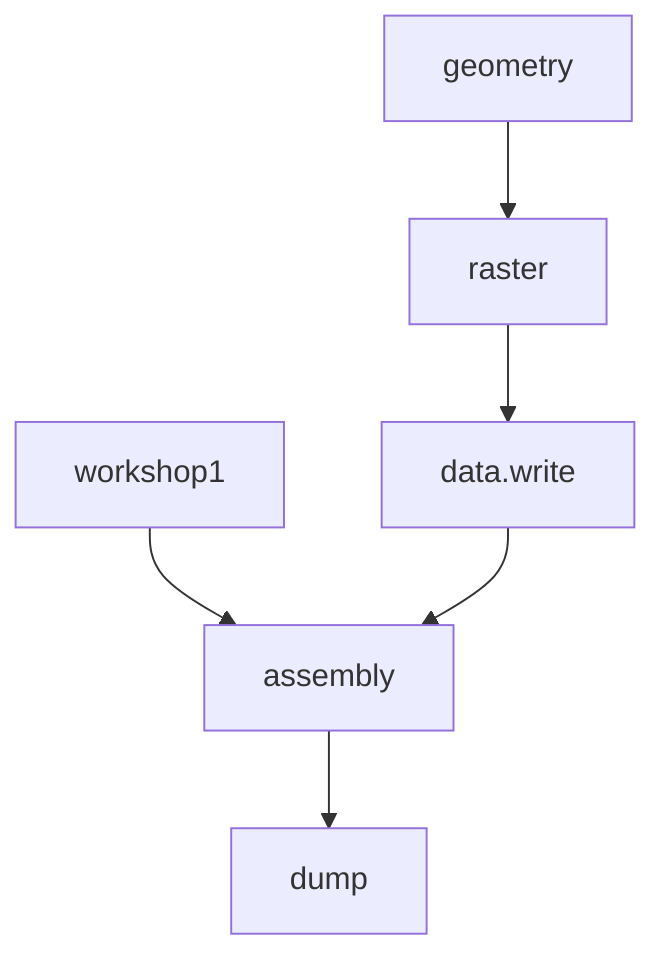
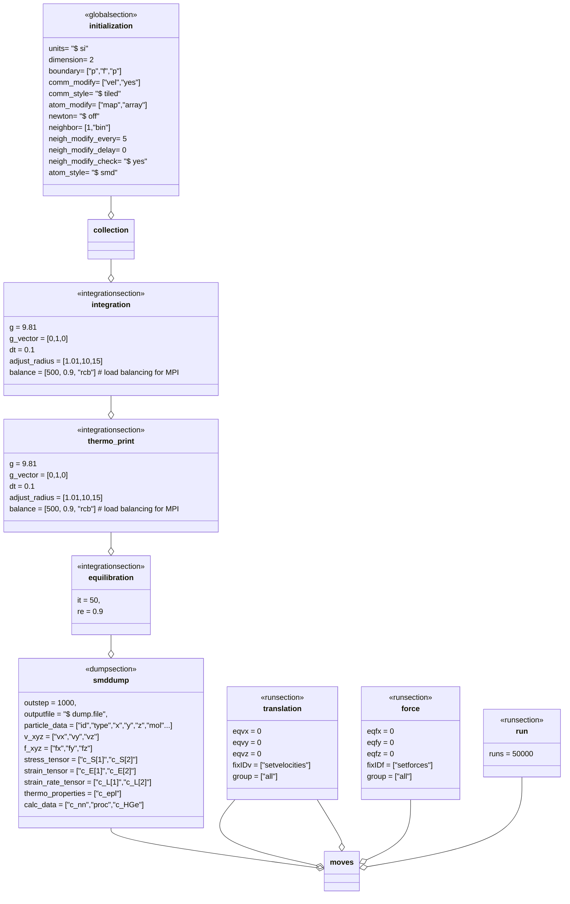
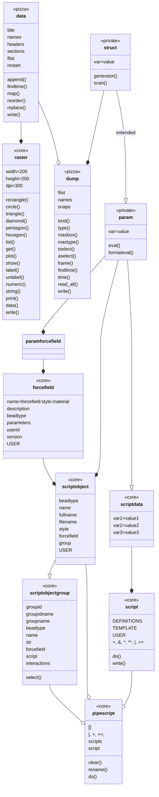

# Pizza3 #

> Contributors:
>
> ​	INRAE\Olivier Vitrac, E-mail: [olivier.vitrac@agroparistech.fr](olivier.vitrac@agroparistech.fr) (main contact)
>
> ​	INRAE\William Jenkinson, E-mail: [william.jenkinson@agroparistech.fr](olivier.vitrac@agroparistech.fr)
>
> $ 2020-04-18 $

##  Scope

Pizza3 is a fork and an extension of Pizza.py toolkit for LAMMPS witten in Python 3.x (the original one is in Python 2.x). It should be seen as loosely integrated collection of tools for LAMMPS.


 The most important achievements are discussed hereafter. Work in progress, come back regularly.


## Overview

Main scripts and classes are shown here.

| Workshops<br> (workable demonstrations) |             **Main classes<br/>and subclasses**              |                    Low-level<br/> classes                    |
| :-------------------------------------: | :----------------------------------------------------------: | :----------------------------------------------------------: |
|            class: workshop1             |                2D drawing class: pizza.raster                |    generic struct class à la Matlab: pizza.private.struct    |
|            script: geometry             |      class to read/write input files: pizza.data3.data       | self-evaluable struct with scripting/alias features: pizza.private.param |
|            script: assembly             |         class to manage dump files: pizza.dump3.dump         |                                                              |
|                                         | advanced scripting classes: pizza.script.script, pizza.script.datascript, pizza.script.scriptobject, pizza.script.scriptobjectgroup, pizza.script.pipescript |                                                              |
|                                         | forcefield classes: pizza.forcefield.forcefield, pizza.forcefield.smd, pizza.forcefield.tlsph, pizza.forcefield.ulsph, pizza.forcefield.none, pizza.forcefield.water, pizza.forcefield.solidfood, pizza.forcefield.rigidwall |                                                              |

## Key steps

The main steps to use  workshop1 are shown here:



## Overview of workshop1 classes

Workshop1 contains 7 main steps and codes as:


```python
# initizalization of the scheme 
bead_kernel_radius = 0.0015
init = initialization(neighbor =[bead_kernel_radius,"bin"])
    
# scriptobject handles bead interactions
FLUID = scriptdata(
        rho = 1000,
        c0 = 100.0,
        q1 = 1.0,
        contact_stiffness = 10000000
    )    
SOLID = scriptdata(
        rho = 2000,
        c0 = 200.0,
        sigma_yield = '0.1*${E}',
        contact_stiffness = 10000000
    )
WALL = scriptdata(
        rho = 3000,
        c0 = 200.0,
        contact_stiffness = 10000000,
        contact_scale = 1.5
    )
b1 = scriptobject(name="bead 1",
                  group = ["rigid", "solid"],
                  filename='./raster_2_types.lmp',
                  forcefield=rigidwall(USER=WALL))
b2 = scriptobject(name="bead 2",
                  group = ["fluid", "ulsph"],
                  filename = './raster_2_types.lmp',
                  forcefield=water(USER=FLUID))
b3 = scriptobject(name="bead 3",
                  group = ["oscillating", "solid","tlsph"],
                  filename = './raster_4_types.lmp',
                  forcefield=solidfood(USER=SOLID))
b4 = scriptobject(name="bead 4",
                  group = ["solid", "tlsph"],
                  filename = './raster_4_types.lmp',
                  forcefield=solidfood(USER=SOLID))

# set gravity, timestep, adjusted kernel radius
inte = integration()
    
# modify which data is returned to the terminal
thermo = thermo_print()
    
# equilibration/relaxation protocol, iterations can be reduced or augmented
equilsteps =   equilibration(it=15)
    
# modify the dump settings, outstep, properties dumped etc.
dmp = smddump(outstep=2000,outputfile=["dump.workshop1"],)
    
# use equations to move specific objects or groups of atoms
moves = translation(vx = ["0.1*exp(-step/100)"],
                        vy = ["0"],vz = ["0"]) & \
		run() & \
        translation() & \
        force() & \
        run()

# combine everything into a full script and write file  
collection = b1+b2+b3+b4
fullscript = init + collection.script + inte \
     			 + thermo + equilsteps + dmp + moves
fullscript.write("./tmp/in.swimmingpool")
```

The equivalent flowchart reads:




## Overview of top classes

The figure highlights the  dependencies between all classes. Note that several operators have been overloaded to facilitate scripting and indexing.



