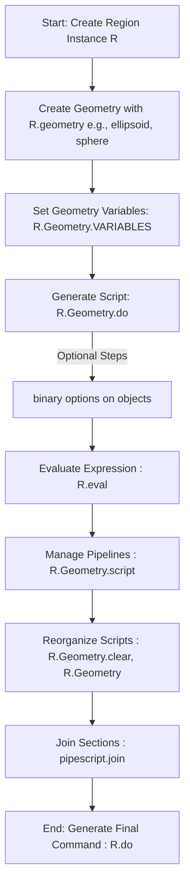

# Pizza.region Python Library Documentation

Han Chan, Olivier Vitrac | INRAE, University of Paris-Saclay | 2023-08-28 | contact: [olivier.vitrac@agroparistech.fr](mailto:olivier.vitrac@agroparistech.fr)

 ==alpha version of the documentation== 

> ## Preamble
>
> Welcome to the documentation of `pizza.region`, an advanced Python library designed to facilitate the handling of regions in LAMMPS (Large-scale Atomic/Molecular Massively Parallel Simulator) simulations. The `pizza.region` module provides a high-level interface for defining and manipulating geometrical objects within LAMMPS simulations.
>
> Just as LAMMPS is a powerful molecular dynamics simulator, `pizza.region` is an essential tool that bridges the gap between complex geometrical objects definition and the LAMMPS syntax. LAMMPS provides a set of predefined "region" commands, each representing a different kind of geometric shape (e.g., block, cone, cylinder, etc.). These commands are versatile and powerful but can sometimes be verbose and not easy to manage when dealing with complex systems or large numbers of regions.
>
> `pizza.region` simplifies this task by encapsulating the region definition commands within Python classes, providing the users with the ability to use familiar Python syntax to define and manipulate regions, and greatly increasing the readability and maintainability of the simulation setup code.
>
> For instance, each geometric shape in LAMMPS is mirrored by a corresponding class in `pizza.region` (e.g., `Block`, `Cone`, `Cylinder`, etc.). This one-to-one correspondence helps to encapsulate the details of the LAMMPS command syntax, allowing users to focus on the high-level design of their simulation.
>
> The central goal of `pizza.region` is to provide a more intuitive, Pythonic interface to LAMMPS region definitions, making it easier to create, modify, and manage complex simulation geometries. Whether you are a novice or an experienced LAMMPS user, `pizza.region` can help you streamline your simulation setup process, increase your productivity, and reduce the risk of errors.
>
> Read on to learn more about how to use `pizza.region` to enhance your LAMMPS simulations.


[TOC]


## 1. Overview

`Pizza.region` is a Python 3 library that provides tools to define native geometries for LAMMPS (Large-scale Atomic/Molecular Massively Parallel Simulator). This library extends the capabilities of Python by providing an interface to easily create, manipulate, and perform operations on regions in LAMMPS.

The library allows the user to concatenate two regions, generate objects, delete objects, create unions and intersections of objects, and evaluate any algebraic expression including objects. 

**Authors**: Olivier Vitrac, Han Chen


### Class dependencies

```Mermaid
classDiagram
    script --|> LammpsGeneric: Inherits
    LammpsGeneric --|> LammpsVariables: Inherits
    LammpsGeneric --|> LammpsRegion: Inherits
    LammpsGeneric --|> LammpsCreate: Inherits
    LammpsGeneric --|> LammpsHeader: Inherits
    LammpsGeneric --|> LammpsFooter: Inherits
    CoreGeometry --|> LammpsVariables: Inherits
    CoreGeometry --|> LammpsRegion: Inherits
    CoreGeometry --|> LammpsCreate: Inherits
    Collection --|> Block: Inherits
    Collection --|> Cone: Inherits
    Collection --|> Cylinder: Inherits
    Collection --|> Ellipsoid: Inherits
    Collection --|> Plane: Inherits
    Collection --|> Prism: Inherits
    Collection --|> Sphere: Inherits
    Collection --|> Union: Inherits
    Collection --|> Intersect: Inherits
    Collection --|> Evalgeometry: Inherits
```

### Typical usage




## 2. Dependencies

The `Pizza.region` library is written in Python 3 and it depends on several Python libraries as listed below:

| Dependency           | Type     | Specific Functions/Modules used      |
| -------------------- | -------- | ------------------------------------ |
| os                   | Built-in |                                      |
| sys                  | Built-in |                                      |
| datetime             | Built-in | datetime                             |
| copy                 | Built-in | copy, deepcopy                       |
| textwrap             | Built-in | fill, shorten                        |
| webbrowser           | Built-in | open (as livelammps)                 |
| pizza.private.struct | Pizza3   | struct, param, paramauto             |
| pizza.script         | Pizza3   | pipescript, script, scriptdata, span |


> It should be noted that built-in dependencies are those libraries that come pre-installed with Python, while external dependencies need to be installed separately. In the case of pizza.private.struct and pizza.script, these are part of the broader pizza package and would be installed when the user installs the pizza package.

## 3. Installation (not endorsed now)

To install the Pizza.region library, clone the repository and install the required dependencies. Note that this documentation assumes that Python 3 and pip are already installed on your system.

First, clone the Pizza.region repository:

```bash
git clone https://github.com/your-repository-url
```

Navigate into the project directory:

```bash
cd your-directory
```

Then install the required dependencies:

```bash
pip install -r requirements.txt
```

## 4. Usage

### 4.1 Basic Usage

Here's a simple example of using the Pizza.region library:

```python
from pizza import region

# Create two regions
R1 = region.Region()
R2 = region.Region()

# Concatenate two regions
R = R1 + R2

# Generate the objects
R.do()

# Get the script
script = R.script
```

In this example, we're creating two regions R1 and R2. We then concatenate these two regions and store the result in R. After that, we generate the objects for R using the `do()` method, and then get the script using the `script` property.

### 4.2 Advanced Usage

The Pizza.region library also provides advanced functionalities, such as creating unions and intersections of objects, and evaluating algebraic expressions. Here's an example:

```python
from pizza import region

# Create a region
R = region.Region()

# Create two objects o1 and o2
o1 = region.Object()
o2 = region.Object()

# Add the objects to the region
R.add(o1)
R.add(o2)

# Create an union of o1 and o2
R.union(o1, o2, name="union")

# Create an intersection of o1 and o2
R.intersect(o1, o2, name="intersection")

# Evaluate an algebraic expression
R.eval("o1+o2", name="result")
```

In this example, we're creating a region R and two objects o1 and o2. We then add these objects to the region. After that, we create an union of o1 and o2, an intersection of o1 and o2, and evaluate an algebraic expression "o1+o2".

Please note that the usage of methods and functionalities will vary based on the exact features of the library at the time of use.

## 5. Contact

For any inquiries, bugs, or suggestions, please contact:

- Olivier Vitrac: olivier.vitrac@agroparistech.fr


- Han Chen: han.chen@inrae.fr

## 6. License

The Pizza.region library is licensed under the GPLv3 license.


## 7. Container Classes

### 7.1. regiondata Class

The `regiondata` class is a subclass of `paramauto` and it is used to store script parameters.

#### Usage:

```python
DEFINITIONS = regiondata(
    var1 = value1,
    var2 = value2
)
```

#### Method:
The `generatorforlammps` method generates LAMMPS code from `regiondata`. It sorts definitions and constructs the LAMMPS command for each definition based on its type. The `verbose` parameter can be used to add more detail to the output, and `hasvariables` can be used to prevent a call of `generatorforLammps()` for scripts others than LammpsGeneric ones.

```python
regiondata_instance.generatorforlammps(verbose=False, hasvariables=False)
```

### 7.2. regioncollection Class

The `regioncollection` class is a subclass of `struct` and it's a container for storing regions and their objects.

#### Constructor:

The `regioncollection` class is not intended to be called directly. When an instance of a subclass of `region` is created, an instance of `regioncollection` is automatically created to store its objects. 

```python
region_instance = region.Region()
```

The `regioncollection` instance can be accessed through the objects property of the `region` instance:

```python
collection = region_instance.objects
```

#### Method:

The `__init__` method initializes the `regioncollection` instance by storing the objects with their alias and their real names.


> Please note that these classes are used to store and manipulate data within the script, and they're not intended to be used directly by the end user. The `region` and `object` classes provide an interface to use these container classes.


## 8. High-Level LAMMPS Classes

LAMMPS classes are required to generate LAMMPS code by using `pizza.script()`class and features.

| Class Name        | Description                                                  | Methods                                                      | Special Methods                                              |
| ----------------- | ------------------------------------------------------------ | ------------------------------------------------------------ | ------------------------------------------------------------ |
| `LammpsGeneric`   | A subclass of `script` used to override the standard `do()` method. Serves as a common class for other Lammps-specific classes. | `do()`: Generates the LAMMPS code with variable definitions. If `printflag` is set to `True`, it prints the command. |                                                              |
| `LammpsVariables` | A subclass of `LammpsGeneric` used to define a script for the LAMMPS variables section. | `__init__(self,VARIABLES=regiondata(),**userdefinitions)`: Constructor. | `__rshift__(self,s)`: Overloads the right shift operator. Duplicates the current instance and updates definitions, user definitions, variables, and template from `s`. |
| `LammpsCreate`    | A subclass of `LammpsGeneric` used for the LAMMPS variables section. Represents the "create_atoms" command in a LAMMPS script. |                                                              |                                                              |
| `LammpsRegion`    | A subclass of `LammpsGeneric` that represents a generic region based on a script. Represents the "region" command in a LAMMPS script. |                                                              |                                                              |
| `LammpsHeader`    | A subclass of `LammpsGeneric` that represents a generic header for pizza.region. Intended to be used with https://editor.lammps.org/. |                                                              |                                                              |
| `LammpsFooter`    | A subclass of `LammpsGeneric` that represents a generic footer for pizza.region. Intended to be used with https://editor.lammps.org/. |                                                              |                                                              |

This table presents an organized overview of the classes and their methods. For further details, one would still refer to the detailed class descriptions and method documentation.

> These classes are private subclasses and should be used via equivalent methods of the `raster()` class. They are specific to LAMMPS and help to construct LAMMPS script sections like variable definitions, region definitions, creation of atoms, and script headers and footers.


# 9. CoreGeometry Class

The `CoreGeometry` class represents the core geometry object, which is a helper class for attributes, side, units, move, rotate, open.

## 9.1 Attributes

| Attribute   | Description                                                  |
| ----------- | ------------------------------------------------------------ |
| `USER`      | Common USER definitions for the three scripts                |
| `VARIABLES` | Variable definitions                                         |
| `SECTIONS`  | Stores scripts (`variables`, `region`, and `create` for the geometry) |

> Please note that these are instance attributes, meaning they belong to an instance of the `CoreGeometry` class. The attributes store data that is relevant to the particular object and can be accessed and modified within the object's methods.

Here's the summarized information in a table format:

| Method         | Description                                                  | Parameters                                                   |
| -------------- | ------------------------------------------------------------ | ------------------------------------------------------------ |
| `__init__`     | Initializes an instance of the `CoreGeometry` class          | `USER`: User-specific data (default `regiondata()`)<br> `VARIABLES`: Variables definition (default `regiondata()`) |
| `update`       | Updates the `USER` content for all three scripts (`variables`, `region` and `create`) | None                                                         |
| `copy`         | Returns a copy of the graphical object                       | `beadtype`: The type of bead (default `None`)<br> `name`: Name of the object (default "") |
| `VARIABLES`    | Returns variables                                            | None                                                         |
| `script`       | Generates a pipe script from sections                        | None                                                         |
| `do`           | Generates a script                                           | `printflag`: If `True`, the script is printed (default `True`) |
| `__repr__`     | Display method                                               | None                                                         |
| `sidearg`      | Validator of side arguments                                  | `side`: Argument to validate                                 |
| `movearg`      | Validator of move arguments                                  | `move`: Argument to validate                                 |
| `unitsarg`     | Validation for units arguments                               | `units`: Argument to validate                                |
| `rotatearg`    | Validator of rotate arguments                                | `rotate`: Argument to validate                               |
| `openarg`      | Validation for open arguments                                | `open`: Argument to validate                                 |
| `__add__`      | Overload addition ("+") operator                             | `C`: Second operand                                          |
| `__iadd__`     | Overload in-place addition ("+=") operator                   | `C`: Operand                                                 |
| `__or__`       | Overload pipe ("                                             | ") operator                                                  |
| `__getstate__` | Getstate for cooperative inheritance / duplication           | None                                                         |
| `__setstate__` | Setstate for cooperative inheritance / duplication           | `state`: State to set                                        |
| `__copy__`     | Copy method                                                  | None                                                         |
| `__deepcopy__` | Deep copy method                                             | `memo`: A dictionary that contains already copied objects    |

> All methods are instance methods, invoked on an instance of `CoreGeometry` class. This table does not include any return values and assumes the reader understands the purpose of each method in the context of `CoreGeometry` class.


## 9.3 Region-derived classes

### Overview

Here's a table summarizing the subclasses of the `CoreGeometry` class and their analogous LAMMPS region command:

| Class        | Description                        | Analogous LAMMPS command |
| ------------ | ---------------------------------- | ------------------------ |
| Block        | Represents a geometrical block     | region block             |
| Cone         | Represents a geometrical cone      | region cone              |
| Cylinder     | Represents a geometrical cylinder  | region cylinder          |
| Ellipsoid    | Represents a geometrical ellipsoid | region ellipsoid         |
| Plane        | Represents a geometrical plane     | region plane             |
| Prism        | Represents a geometrical prism     | region prism             |
| Sphere       | Represents a geometrical sphere    | region sphere            |
| Union        | Represents a union of shapes       | region union             |
| Intersect    | Represents intersection of shapes  | region intersect         |
| EvalGeometry | Stores evaluated objects           | (no direct equivalent)   |

Each of these classes encapsulates the logic needed to generate the corresponding LAMMPS region command, abstracting away the specifics of the LAMMPS syntax and allowing the user to focus on higher-level aspects of their simulation. The `EvalGeometry` class is somewhat special because it doesn't correspond to a specific LAMMPS command but rather represents the result of evaluating a `region.eval()` command, which could be any region expression.

### Details 

**Block Class**:
This class is a representation of a geometrical block. It takes in parameters like counter, index, subindex, and other variables and sets them as class attributes. The counter is used to create a unique name for the block instance. The class attributes also include 'kind', 'alike', and 'beadtype' which are specific to the Block class. It then calls the superclass `coregeometry` constructor with the style parameter as "$block" and any other variables provided.

**Cone Class**:
The Cone class follows a similar structure as the Block class. It represents a geometrical cone. The style parameter passed to the superclass `coregeometry` constructor is "$cone".

**Cylinder Class**:
This class is used to represent a geometrical cylinder. The structure is similar to the above classes with the style parameter being "$cylinder".

**Ellipsoid Class**:
The Ellipsoid class represents a geometrical ellipsoid. The style parameter passed to the superclass `coregeometry` constructor is "$ellipsoid".

**Plane Class**:
The Plane class is used to represent a geometrical plane. It follows a similar structure with the style parameter being "$plane".

**Prism Class**:
This class is used to represent a geometrical prism. The structure is similar to the above classes with the style parameter being "$prism".

**Sphere Class**:
The Sphere class is used to represent a geometrical sphere. It follows a similar structure with the style parameter being "$sphere".

**Union Class**:
The Union class is used to represent a geometrical union of shapes. The style parameter is "$union".

**Intersect Class**:
The Intersect class represents the intersection of geometrical shapes. The style parameter passed to the superclass `coregeometry` constructor is "$intersect".

**Evalgeometry Class**:
This class is used to store evaluated objects with `region.eval()`. It follows a similar structure to the above classes but does not have a style parameter as it's a generic class.


## 9.4 Collection class

### Purpose

The Collection class represents a collection of geometrical objects. The geometrical objects are stored in a `regioncollection` object, which is initialized when a Collection object is created.

The `Collection` class in Python is essentially a container that holds a collection of objects or items. It provides a way to store, retrieve, and manipulate a group of objects in an organized and efficient manner.

The purpose of the `Collection` class can vary depending on its usage, but in general, it is used to:

1. **Store Data**: A collection can hold multiple items, which makes it an excellent tool for storing related data together. This can simplify data manipulation and improve code readability.
2. **Data Manipulation**: The `Collection` class usually provides methods to add, remove, or change items, making it a versatile tool for data manipulation.
3. **Efficient Access and Organization**: Collections are often implemented with efficiency in mind, allowing fast access, search, or organization of items. Depending on the specific type of collection, it can be optimized for specific tasks such as quickly finding an item, maintaining a sorted order, or even ensuring uniqueness of elements.

> In the context of LAMMPS (Large-scale Atomic/Molecular Massively Parallel Simulator), the `Collection` class might be used to hold and manage a collection of geometrical objects (like spheres, blocks, ellipsoids) that constitute a larger molecular system. It likely provides methods to manipulate these geometrical objects in the context of a molecular simulation, such as rotating, translating, or even combining them.

### Usage

The Collection class is used to manage multiple geometrical objects, and it provides easy access and operations on these objects. It is helpful when you have many geometrical objects and want to perform actions on them collectively. With the Collection class, you can add, retrieve, and perform other operations on these objects conveniently.

### Methods

Here's a summary of the `Collection` class methods:

| Method                                                    | Description                                                  |
| --------------------------------------------------------- | ------------------------------------------------------------ |
| `__init__(self,USER=regiondata(),VARIABLES=regiondata())` | The constructor of the `Collection` class. Initializes an instance of the `Collection` class. |
| `script(self)`                                            | Generates a pipe script from sections.                       |
| `do(self,printflag=True)`                                 | Generates a script. If `printflag` is True, the script is printed. |
| `__repr__(self)`                                          | Display method.                                              |
| `__getitem__(self, k)`                                    | Method to return an item from the collection using indexing. |
| `__setitem__(self, k, v)`                                 | Method to set an item in the collection using indexing.      |
| `__delitem__(self, k)`                                    | Method to delete an item from the collection using indexing. |
| `__iter__(self)`                                          | Iterator method, returns an iterator for the object.         |
| `__len__(self)`                                           | Returns the length of the collection.                        |
| `keys(self)`                                              | Returns the keys in the collection.                          |
| `values(self)`                                            | Returns the values in the collection.                        |
| `items(self)`                                             | Returns a set-like object providing a view on the collection's items. |
| `__contains__(self, k)`                                   | Returns True if k is in the collection, False otherwise.     |
| `clear(self)`                                             | Removes all items from the collection.                       |
| `get(self, k, d=None)`                                    | Returns the value for k if k is in the collection, else d.   |
| `__eq__(self, other)`                                     | Checks equality of the collection with another object.       |
| `update(self, E=None, **F)`                               | Updates the collection with the key/value pairs from other, overwriting existing keys. |
| `pop(self, k, d=__marker)`                                | Removes and returns an element from a dictionary having the given key. |
| `setdefault(self, k, d=None)`                             | If key is in the dictionary, return its value. If not, insert key with a value of default and return default. |

> Please note that these methods are specific to the `Collection` class and provide functionality for manipulating and accessing the collection of objects.


***


# Class Documentation: Region

## Description:

The `Region` class is a part of the PIZZA framework that handles the creation and manipulation of regions within a simulation. Regions can be various geometrical objects like blocks, cones, spheres, etc., and are essentially areas where some physical properties or conditions apply in the simulation.

Each instance of the `Region` class represents a region in a simulation with various attributes that describe its properties and behavior.

## Class Attributes:

- `_version`: A string specifying the version of the class.

- `live`: An instance of the `regiondata` class containing live data for the region.

- `name`: A string representing the name of the region.

- `volume`: A scalar representing the volume of the region.

- `mass`: A scalar representing the mass of the region.

- `radius`: A scalar representing the radius of the region.

- `contactradius`: A scalar representing the contact radius of the region.

- `velocities`: A list containing the velocities of the region in three directions.

- `forces`: A list containing the forces acting on the region in three directions.

- `filename`: A string representing the filename of the region.

- `index`: An integer representing the index of the region.

- `objects`: A dictionary that stores all the objects in the region.

- `nobjects`: An integer representing the total number of objects in the region.

- `counter`: A dictionary that stores the count of different types of objects in the region.

- `livelammps`: A dictionary that holds the details related to live sessions in LAMMPS (Large-scale Atomic/Molecular Massively Parallel Simulator).

## Constructor:

The constructor of the `Region` class can take numerous parameters related to region properties, data conversion (not implemented as of now), and other properties. Not all of them are required, and they will use default values if not provided.

## Methods:

- `block`: This method creates a block region with specified properties. It takes parameters like `xlo`, `xhi`, `ylo`, `yhi`, `zlo`, `zhi`, `name`, `beadtype`, `fake`, `side`, `units`, `move`, `rotate`, `open`, `index`, `subindex`, and `**variables`.

- `cone`: This method creates a cone region with specified properties. It takes parameters like `dim`, `c1`, `c2`, `radlo`, `radhi`, `lo`, `hi`, `name`, `beadtype`, `fake`, `side`, `units`, `move`, `rotate`, `open`, `index`, `subindex`, and `**variables`.

**Please note:** The `Region` class is expected to have other methods for creating different types of geometries like `cylinder`, `ellipsoid`, `plane`, `prism`, `sphere`, `union`, and `intersect`. They are not shown here but would have a similar structure to the `block` and `cone` methods.

## Examples:

```python
# creating a region with default parameters
r1 = Region()

# creating a region with some custom parameters
r2 = Region(name="region2", volume=2, mass=2)

# creating a block in the region
r1.block(xlo=-5, xhi=5, ylo=-5, yhi=5, zlo=-5, zhi=5, name="block1")

# creating a cone in the region
r1.cone(dim="z", c1=0, c2=0, radlo=2, radhi=5, lo=-10, hi=10, name="cone1")
```


## List of geometries

Please note that the URL provided in the docstring, https://docs.lammps.org/region.html, will help you find more detailed explanations of these regions and their parameters. The provided URL refers to the documentation of the Large-scale Atomic/Molecular Massively Parallel Simulator (LAMMPS), a classical molecular dynamics code that can model an ensemble of particles in a liquid, solid, or gaseous state.

This is a continuation of a class definition for a region creator in a physics simulation, such as the ones used in molecular dynamics. These methods define how to create different types of regions (prism, sphere, union, intersection). The regions are defined by their bounding coordinates and parameters for optional transformation (like rotation and displacement over time).

Each method has multiple parameters that are usually set to their default values. The methods first check if the passed name is not None or an empty string, and if the beadtype is provided, it gets assigned as well. They then check if the name of the region already exists in the system. If it does, it raises a NameError. If not, it proceeds to create a new region object of the specific type and populate it with the provided parameters. If the "fake" parameter is set to True, it doesn't actually add the region to the system but returns the created object for inspection. 

### 1. cylinder

`cylinder` method creates a cylinder-shaped region. 

```python
cylinder(self,dim="z",c1=0,c2=0,radius=4,lo=-10,hi=10,
          name=None,beadtype=None,fake=False,
          side=None,units=None,move=None,rotate=None,open=None,
          index = None,subindex = None,
          **variables
          )
```
The user can specify the dimension of the cylinder axis, the coordinates of the cylinder axis in the other two dimensions, the radius of the cylinder, and the bounds of the cylinder in the chosen dimension. Additional properties such as the side, units, move, rotate, and open can also be specified.

### 2. ellipsoid
`ellipsoid` method creates an ellipsoid-shaped region.

```python
ellipsoid(self,x=0,y=0,z=0,a=5,b=3,c=2,
           name=None,beadtype=None,fake=False,
           side=None,units=None,move=None,rotate=None,open=None,
           index = None,subindex = None,
           **variables
           )
```
In this case, the user can specify the center of the ellipsoid and half the length of the principal axes of the ellipsoid. Similar to the `cylinder` method, additional properties such as the side, units, move, rotate, and open can also be specified.

### 3. plane
`plane` method creates a plane region.

```python
plane(self,px=0,py=0,pz=0,nx=0,ny=0,nz=1,
       name=None,beadtype=None,fake=False,
       side=None,units=None,move=None,rotate=None,open=None,
       index = None,subindex = None,
       **variables
       )
```
The user can specify a point on the plane and the direction normal to the plane. Like the other methods, the user can also specify additional properties such as the side, units, move, rotate, and open.

For all these methods, the optional `name` parameter can be used to assign a specific name to the created region, and `beadtype` specifies the bead type to be used for `create_atoms`. If `fake` is set to True, the method will return the region object without adding it to the objects of the class instance. If `fake` is set to False (default), the method will add the region object to the objects of the class instance and increase the corresponding counters. The `index` and `subindex` parameters are used for indexing the created region. If not provided, they are automatically determined based on the count of the created regions.

### 4. prism

- `prism`: Creates a prism region with bounds defined by `xlo, xhi, ylo, yhi, zlo, zhi` and tilt angles `xy, xz, yz`.

### 5. sphere

- `sphere`: Creates a spherical region centered at `x, y, z` with radius `radius`.

### 6. Union 

- `union`: Creates a region that is the union of multiple regions whose names or indices are passed as `*regID`.

### 7. Intersect

- `intersect`: Similar to `union`, but this creates a region that is the intersection of the regions passed as `*regID`.

These methods would be used in the context of a larger simulation to define the regions within which physical entities (atoms, molecules, etc.) exist and interact.

### 8. Collection

`collection`: This method is for creating a new collection of objects. It begins by setting an index and subindex based on the current counters if not provided, then creates a new `Collection` instance. If a `name` is provided and it is not already in use, it assigns the `name` to the new `Collection` instance. If a `beadtype` is provided, it assigns this to the `beadtype` attribute of the `Collection` instance. The method then calls the `regioncollection` function with the provided `obj` and `kwobj` to fill the `Collection` instance's `collection` attribute. Finally, it iterates over the items in the `collection`, potentially modifies the `beadtype` of each, and adds them back to the `collection`. If `fake` is `False`, the method increments the counters, adds the `Collection` instance to `self.objects`, and increments `self.nobjects`.

### 9. Scatter

`scatter`: This method is for creating a collection from a `scatter` or `emulsion` object. It checks if the input object `E` is of the type `scatter`. If it is, it creates a dictionary `collect` to store the objects generated by calling the `self.sphere` method using the properties of `E`. The `self.collection` method is then called with this dictionary to add all these objects to a new collection. If the input `E` is not a `scatter` object, a `TypeError` is raised. 

These methods are for managing and manipulating collections of objects, allowing for the flexible creation, modification, and storage of these collections in a larger system or environment. 

### 10. Generic methods

List of useful methods:

| Method Name | Description                                                  | Inputs                                                       | Outputs                                                      |
| :---------- | :----------------------------------------------------------- | :----------------------------------------------------------- | :----------------------------------------------------------- |
| list        | Lists all objects in the current region, along with their names, kinds, bead types, indexes and subindexes. | None                                                         | None (prints output)                                         |
| names       | Returns the names of objects sorted as per their index.      | None                                                         | A list of names of objects in the region.                    |
| nbeads      | Returns the number of bead types used in the region.         | None                                                         | An integer value denoting the number of bead types.          |
| count       | Counts the objects in the region by their types.             | None                                                         | A list of tuples, each containing a bead type and its count. |
| delete      | Deletes a specified object from the region.                  | A string `name`, which is the name of the object to be deleted. | None                                                         |

Here are more details:

1. **list**: This method is for printing out information about each object in the region. It prints out the name of the region and the number of objects, followed by the name, kind, bead type, index, and subindex of each object.

2. **names**: This is a property method that returns a list of the names of objects in the region, sorted by their index. 

3. **nbeads**: This is a property method that returns the number of bead types used in the region. If the region is not empty, it returns the maximum of the count of bead types and `self.live.nbeads`. If the region is empty, it returns `self.live.nbeads`.

4. **count**: This method counts and returns the number of objects by their type in the region. It creates a list of bead types, removes duplicates, and counts the number of occurrences of each bead type.

5. **delete**: This method deletes an object from the region. If the object is present, it deletes the object, decrements `self.nobjects` and the appropriate counters, and if it is not, it raises a `NameError`.

All these methods are designed to make it easier to manage and manipulate a region of objects. They allow the user to access important information about the region and its objects, as well as modify the region by deleting objects.


### 11. Scripting methods

Here's a more detailed tabular breakdown of these high-level methods. 

| Method Name | Description                                                  | Inputs                                                       | Outputs                                                      |
| :---------- | :----------------------------------------------------------- | :----------------------------------------------------------- | :----------------------------------------------------------- |
| eval        | Evaluates (combines scripts of) an expression combining objects. | `expression`: An expression combining objects, `name`: Name for the resulting object (optional), `beadtype`: Bead type for the resulting object (optional), `fake`: Boolean to specify whether to create a fake object or not (optional), `index`: Index of the object (optional), `subindex`: Subindex of the object (optional) | None or the newly created Evalgeometry object if `fake` is True |
| pipescript  | Generates a pipescript for all objects in the region.        | None                                                         | A pipescript object containing all objects in the region.    |
| script      | Adds header and footer to the pipescript.                    | `live`: Boolean to specify whether to return the live script or not (optional) | A string representing the entire script.                     |
| do          | Executes the entire script.                                  | None                                                         | The result of executing the script.                          |
| dolive      | Executes the entire script for online testing.               | None                                                         | The path to the temporary file storing the script.           |

Here are more detailed descriptions:

1. **eval**: This method evaluates (i.e., combines scripts) an expression combining objects in the region and creates a new `Evalgeometry` object. The expression should be a `coregeometry` object. The new `Evalgeometry` object will be added to the region's `objects` unless `fake` is set to `True`.

   Example:
   ```
   R = region(name="my region")
   R.eval(o1 + o2 + ..., name='obj')
   ```

2. **pipescript**: This method generates a pipescript for all objects in the region. The method first executes all non-Collection objects in the region and then concatenates all objects into a pipescript. The pipescript is returned.

3. **script**: This method first gets the pipescript for the region using the `pipescript` method. If `live` is `True`, the method adds a header and footer to the pipescript using the `LammpsHeader` and `LammpsFooter` classes. The complete script is returned as a string.

4. **do**: This method executes the entire script of the region. It first generates a pipescript for the region and then executes it. The result of the execution is returned.

5. **dolive**: This method executes the entire script for online testing. It generates a live script and writes it to a temporary file. If the live server is not active, it opens a new browser window or tab at the live server URL. The method then returns the path to the temporary file. This is helpful for debugging and testing scripts in real-time. 

   For example:
   ```
   R = region(name="my region")
   file_path = R.dolive()
   ```
   This will execute the script on an online testing server and return the path to the file where the script is stored.


### 12. Classes to generate complex objects

#### 12.1 scatter class

The `scatter` class is a generic class that provides an easy constructor to distribute objects in a 3D space according to their x, y, and z positions, radius (r), and bead type.

| Properties/Methods  | Description                                                  |
| ------------------- | ------------------------------------------------------------ |
| `__init__()`        | Constructor to initialize empty numpy arrays for the x, y, and z coordinates, the radius (r), and an empty list for the bead types. |
| `n`                 | Property that returns the number of elements in the x (or y or z) array. |
| `pairdist(x, y, z)` | Calculates and returns the pair distance to the surface of all spheres from a given point (x, y, z). If no elements have been added yet, it returns infinity. |

#### 12.2 emulsion class

The `emulsion` class is derived from the `scatter` class. It generates an emulsion, i.e., it scatters objects in a predefined 3D box.

| Properties/Methods                                           | Description                                                  |
| ------------------------------------------------------------ | ------------------------------------------------------------ |
| `__init__(xmin=10, ymin=10, zmin=10, xmax=90, ymax=90, zmax=90, maxtrials=1000, beadtype=1, forcedinsertion=True)` | Constructor to initialize the emulsion. Parameters specify the boundaries of the box, the maximum number of attempts for an object, the default bead type, and whether to force the next insertion if the previous one fails. |
| `__repr__()`                                                 | Returns a string representation of the emulsion object.      |
| `walldist(x, y, z)`                                          | Returns the shortest distance to the wall from a given point (x, y, z). |
| `dist(x, y, z)`                                              | Returns the shortest distance of the center (x, y, z) to the wall or any object. |
| `accepted(x, y, z, r)`                                       | Returns a boolean value indicating whether the object at center (x, y, z) with radius r can be accepted without overlapping other objects or the walls. |
| `rand()`                                                     | Returns random x, y, z coordinates within the emulsion box.  |
| `setbeadtype(beadtype)`                                      | Sets the bead type for the object. If beadtype is not provided, it uses the default bead type. |
| `insertone(x=None, y=None, z=None, r=None, beadtype=None, overlap=False)` | Tries to insert one object at (x, y, z) with radius r and beadtype. If any of these parameters is missing, it generates a random value. If overlap is set to True, it accepts overlapping with existing objects. |
| `insertion(rlist, beadtype=None)`                            | Tries to insert a list of objects with radii specified in rlist and a common beadtype. The beadtype parameter is optional. If it's not provided, the default bead type is used. |


# Examples

## Gel compression

The following example demonstrates the construction of a gel compression model using cylinders of different types and sizes:

```python
# EXAMPLE: gel compression
name = ['top','food','tongue','bottom']
scale = 1 # tested up to scale = 10 to reach million of beads
radius = [10,5,8,10]
height = [1,4,3,1]
spacer = 2 * scale
radius = [r*scale for r in radius]
height = [h*scale for h in height]
position_original = [spacer+height[1]+height[2]+height[3],
                     height[2]+height[3],
                     height[3],
                     0]
beadtype = [1,2,3,1]
total_height = sum(height) +spacer
position = [x-total_height/2 for x in position_original]
B = region(name = 'region container',
           width=2*max(radius),
           height=total_height,
           depth=2*max(radius))
for i in range(len(name)):
    B.cylinder(name = name[i],
               c1=0,
               c2=0,
               radius=radius[i],
               lo=position[i],
               hi=position[i]+height[i],
               beadtype=beadtype[i])
B.dolive()
```

In this example, the gel is modeled using different types of cylinders (with varying radii and heights) that are stacked on top of each other. This forms a stack of 'layers' that represent the gel's structure.

1. The names of these layers are stored in `name`.
2. The scale factor is set to 1. This can be changed to generate larger models.
3. The radii and heights of the cylinders are defined.
4. A `spacer` is used to add an extra gap between the cylinders.
5. The initial positions of the cylinders are calculated and stored in `position_original`.
6. The beadtype of each cylinder is also defined.
7. The total height of the model is calculated.
8. A new region is created, `B`, that will contain all the cylinders.
9. A loop is used to add each cylinder to the region `B`.
10. Finally, the model is visualized using the `dolive()` method.

In the visualization, you will see a set of cylinders of different sizes and types, stacked on top of each other in the region `B`. The 'gel compression' is modeled by this structure of cylinders.

## Emulsion

This example creates an emulsion by scattering three different types of beads within a specific region. The steps are as follows:

```python
import numpy as np

# Create an emulsion object. The space is a 10x10x10 cube centered at the origin.
e = emulsion(xmin=-5, ymin=-5, zmin=-5,xmax=5, ymax=5, zmax=5)

# Insert the first group of spheres with different radii (2, 2, 2, 1, 1.6, 1.2, 1.4, 1.3) and beadtype 3.
e.insertion([2,2,2,1,1.6,1.2,1.4,1.3],beadtype=3)

# Insert the second group of spheres with different radii (0.6, 0.3, 2, 1.5, 1.5, 1, 2, 1.2, 1.1, 1.3) and beadtype 1.
e.insertion([0.6,0.3,2,1.5,1.5,1,2,1.2,1.1,1.3],beadtype=1)

# Insert the third group of spheres with different radii (3, 1, 2, 2, 4, 1, 1.2, 2, 2.5, 1.2, 1.4, 1.6, 1.7) and beadtype 2.
e.insertion([3,1,2,2,4,1,1.2,2,2.5,1.2,1.4,1.6,1.7],beadtype=2)

# Create a region object and scatter the emulsion inside it.
C = region(name='cregion')
C.scatter(e)

# Group all the spheres in the region.
g = C.emulsion.group()

# Create the script for the region.
C.script()

# Execute the entire script for online testing.
C.dolive()
```

This script initially defines an `emulsion` object `e` with a cuboidal volume centered at the origin with sides 10 units long. Then three types of beads are scattered within this volume. The radii of the beads and their types (denoted by an integer identifier) are specified for each group of beads.

A `region` object `C` is created where the emulsion `e` is scattered. The beads in the region are then grouped together using the `group` method.

Finally, the `script` method creates a script that describes all the objects in the region, and `dolive` method executes the entire script for online testing. This will open up a window where you can observe the created emulsion in a 3D space in real time.


## Advanced features

> These examples list advanced features available in `pizza.region()`

Sure, I'll interpret the provided code and generate more sophisticated examples, explaining each step of the way. Let's break it down and create more examples.

```python
# EXAMPLE 1: Manipulating Variables of an Ellipsoid in a Region
R = region(name="region_1")
R.ellipsoid(0, 0, 0, 1, 1, 1, name="E1", toto=3)
R.E1.VARIABLES.a = 1
R.E1.VARIABLES.b = 2
R.E1.VARIABLES.c = "(${a},${b},100)"
R.E1.VARIABLES.d = '"%s%s" %("test",${c})'
code1 = R.E1.do()
print(code1)
```
In this example, we first create a region and an ellipsoid within that region. Then, we set and modify some variables of the ellipsoid using the `VARIABLES` attribute. Lastly, we generate the script for the ellipsoid using the `do()` method.

```python
# EXAMPLE 2: Using Complex Variable Expressions for an Ellipsoid
R.ellipsoid(0,0,0,1,1,1,name="E2",side="out",move=["left","${up}*3",None],up=0.1)
R.E2.VARIABLES.left = '"swiggle(%s,%s,%s)"%(${a},${b},${c})'
R.E2.VARIABLES.a = "${b}-5"
R.E2.VARIABLES.b = 5
R.E2.VARIABLES.c = 100
code2 = R.E2.do()
print(code2)
```
Here, we create another ellipsoid in the same region. The interesting part here is that the `move` parameter receives an array with complex expressions that depend on a variable (`up`). After defining the ellipsoid, we set more complex expressions for the ellipsoid's variables.

```python
# EXAMPLE 3: Creating New Ellipsoids by Performing Operations on Existing Ones
R.set('E3', R.E2)
R.E3.beadtype = 2
R.set('add', R.E1 + R.E2)
R.addd2 = R.E1 + R.E2
R.eval(R.E1 | R.E2,'E12')
```
In this example, we're demonstrating how to create new ellipsoids by using operations (`+` and `|`) on existing ellipsoids in the region. The `set()` method is used to assign a new ellipsoid to a given name. The `eval()` method is used to evaluate an operation on two ellipsoids and assign the result to a new name.

```python
# EXAMPLE 4: Working with Pipelines and Scripts
p = R.E2.script
s = p.script() # First execution
s = p.script() # Do nothing
p.clear() # Undo executions first
q = p[[0,2,1]] # Change order of execution
sq = q.script() # Generate the script with the new order
```
In this example, we work with pipelines and scripts. We first get the script associated with the second ellipsoid (`E2`). Then, we run the script twice. Note that the second run does nothing because the pipeline has not changed. Then, we clear the pipeline and change the order of the commands. We then generate and run the script with the new order.

```python
# EXAMPLE 5: Joining Sections of Different Ellipsoids
liste = [x.SECTIONS["variables"] for x in R]
pliste = pipescript.join(liste)
```
Here, we're demonstrating how to join sections of different ellipsoids in a region. We first get the "variables" section of each ellipsoid in the region, and then join these sections using `pipescript.join()`.

```python
# EXAMPLE 6: More Complex Variable Manipulation with Production in Mind
P = region(name="live test",width = 20)
P.ellipsoid(0, 0, 0, "${Ra}", "${Rb}", "${Rc}", name="E1", Ra=5, Rb=2, Rc=3)
P.sphere(7,0,0,radius="${R}",name = "S1", R=2)
cmd = P.do()
print(cmd)
#outputfile = P.dolive()
```
Finally, we create a more complex example with a view towards a production environment. We create a new region and two different shapes (an ellipsoid and a sphere) within it. Both shapes have parameters that depend on variables. We then generate and print the script using the `do()` method, and visualize the region (commented out here for simplicity).
