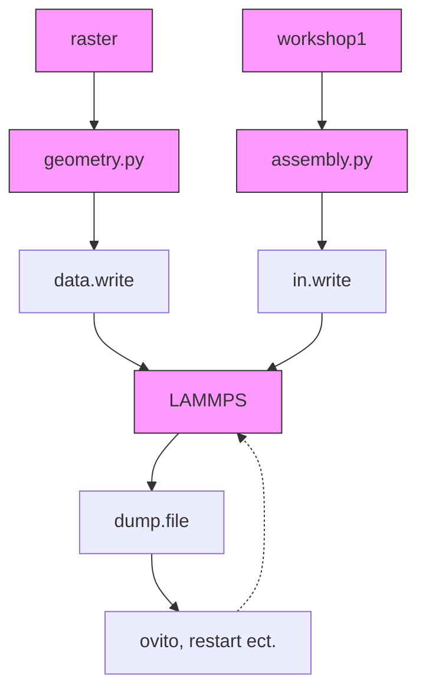

# Workshop 1 #

> Contributors:
>
> ​	INRAE\Olivier Vitrac, E-mail: [olivier.vitrac@agroparistech.fr](olivier.vitrac@agroparistech.fr) (main contact)
>
> ​	INRAE\William Jenkinson, E-mail: [william.jenkinson@agroparistech.fr](olivier.vitrac@agroparistech.fr)
>
> $ 2022-04-01 $

[TOC]

##  Objectives

**Workshop0** - to generate a LAMMPS script

*Learning Outcome:*

1. Introduce the interface, codes, and concepts
2. Introduce the notion that a LAMMPS scripts can be broken down and modularized to give better control of parameters
3. Start using the Python codelets (initialization(), integration(), dump()) to build a LAMMPS script


**Workshop1** - to generate a LAMMPS script that can be executed

*Learning Outcome:*

1. More context of the application of classes such as workshop1() and raster() to feed geometry.py and assembly.py scripts
2. Go deeper into Python codelets, begin playing with the parameters
3. Begin an iterative design process between Pizza3 and LAMMPS


**Workshop2** - to use new tools in raster() to build a first shear suspension simulation

*Learning Outcomes:* TBC


## Overview of classes and scripts

The principle 'interface' for using Pizza3 is with these certain classes and scripts:

- workshop1()
- raster()
- geometry.py
- assembly.py





##  Output of workshop1

### LAMMPS script

```perl
# Automatic LAMMPS script (version 0.4)
# olivi@LX-Olivier2021:/home/olivi/billy/python
# ven. 18 mars 2022 19:33:50 

 

# INRAE\SAYFOOD\olivier.vitrac@agroparistech.fr
# INRAE\SAYFOOD\william.jenkinson@agroparistech.fr


#   Scheme initialization
units       si
dimension	2 
boundary    p f p         # f = fixed, p = periodic
comm_modify vel yes
comm_style  tiled
atom_modify map array
newton off
neighbor	0.0015 bin            # search radius for neighbor list (=kernel radius)
neigh_modify    every 5 delay 0 check yes

atom_style	smd
 

# ===== [ BEGIN INPUT FILES SECTION ] ===============================================================================

# load files for objects: bead 1, bead 2
	read_data ./raster_2_types.lmp

# load files for objects: bead 3, bead 4
	read_data ./raster_4_types.lmp add append

# ===== [ END INPUT FILES SECTION ] =================================================================================


# ===== [ BEGIN GROUP SECTION ] =====================================================================================

	#	Definition of group 1:rigid
	#	=bead 1
	#	Similar groups: rigid, solid
	group 	 rigid 	type 	 1

	#	Definition of group 2:solid
	#	=bead 1, bead 3, bead 4
	#	Similar groups: rigid, solid, oscillating, tlsph
	group 	 solid 	type 	 1 3 4

	#	Definition of group 3:fluid
	#	=bead 2
	#	Similar groups: fluid, ulsph
	group 	 fluid 	type 	 2

	#	Definition of group 4:ulsph
	#	=bead 2
	#	Similar groups: fluid, ulsph
	group 	 ulsph 	type 	 2

	#	Definition of group 5:oscillating
	#	=bead 3
	#	Similar groups: oscillating, solid, tlsph
	group 	 oscillating 	type 	 3

	#	Definition of group 6:tlsph
	#	=bead 3, bead 4
	#	Similar groups: oscillating, solid, tlsph
	group 	 tlsph 	type 	 3 4

# ===== [ END GROUP SECTION ] =======================================================================================


# ===== [ BEGIN FORCEFIELD SECTION ] ================================================================================
    # [1:bead 1] PAIR STYLE SMD
    pair_style      hybrid/overlay smd/ulsph *DENSITY_CONTINUITY *VELOCITY_GRADIENT *NO_GRADIENT_CORRECTION &
                                   smd/tlsph smd/hertz 1.5
    
    # [1:bead 1 x 1:bead 1] Diagonal pair coefficient tlsph
    pair_coeff      1 1 none
    
    # [2:bead 2 x 2:bead 2] Pair diagonal coefficient ulsph
    pair_coeff      2 2 smd/ulsph *COMMON 1000 100.0 1.0 1.0 0 &
                    *EOS_TAIT 7 &
                    *END
    
    # [3:bead 3 x 3:bead 3] Diagonal pair coefficient tlsph
    pair_coeff      3 3 smd/tlsph *COMMON 2000 400000000.0 0.3 1.0 0.0 10 1.0 &
                    *STRENGTH_LINEAR_PLASTIC 40000000.0 0 &
                    *EOS_LINEAR &
                    *END
    
    # [4:bead 4 x 4:bead 4] Diagonal pair coefficient tlsph
    pair_coeff      4 4 smd/tlsph *COMMON 2000 400000000.0 0.3 1.0 0.0 10 1.0 &
                    *STRENGTH_LINEAR_PLASTIC 40000000.0 0 &
                    *EOS_LINEAR &
                    *END
    
    # [1:bead 1 x 2:bead 2] Off-diagonal pair coefficient (generic)
    pair_coeff      1 2 smd/hertz 10000000
    
    # [1:bead 1 x 3:bead 3] Off-diagonal pair coefficient (generic)
    pair_coeff      1 3 smd/hertz 10000000
    
    # [2:bead 2 x 3:bead 3] Off-diagonal pair coefficient (generic)
    pair_coeff      2 3 smd/hertz 10000000
    
    # [1:bead 1 x 4:bead 4] Off-diagonal pair coefficient (generic)
    pair_coeff      1 4 smd/hertz 10000000
    
    # [2:bead 2 x 4:bead 4] Off-diagonal pair coefficient (generic)
    pair_coeff      2 4 smd/hertz 10000000
    
    # [3:bead 3 x 4:bead 4] Off-diagonal pair coefficient (generic)
    pair_coeff      3 4 smd/hertz 10000000
    
# ===== [ END FORCEFIELD SECTION ] ==================================================================================


#   Gravity
fix             gfix all gravity 9.81 vector 0 1 0
#   Time integration conditions
fix             dtfix fluid smd/adjust_dt 0.1 # dynamically adjust time increment every step
fix             integration_fix_ulsph ulsph smd/integrate_ulsph adjust_radius 1.01 10 15
fix             integration_fix_tlsph tlsph smd/integrate_tlsph
#   balancing
fix             balance_fix all balance 500 0.9 rcb


#   thermodynamic information
thermo		   100
thermo_modify  lost ignore
thermo_style   custom step dt


#   Equilibration
dump            dump_equilibrate all custom 100 dump.equilibrate id type x y z &
                fx fy fz vx vy vz radius
dump_modify     dump_equilibrate first yes

variable vmag atom sqrt(vx^2+vy^2+vz^2)
compute         maxvel all reduce max v_vmag
variable        maxvelre equal 0.6*c_maxvel
run     10000 every 1000 &
    "print ${maxvelre}" &
    "fix             ulsph_equilibration ulsph smd/integrate_ulsph limit_velocity ${maxvelre}" &
    "fix             tlsph_equilibration tlsph smd/integrate_tlsph limit_velocity ${maxvelre}"

dump_modify     dump_equilibrate every 1000000

fix             ulsph_equilibration ulsph smd/integrate_ulsph
fix             tlsph_equilibration tlsph smd/integrate_tlsph


#   Additional computed values
        
#   Compute supp particle data
compute         contact_radius all smd/contact/radius
compute         vol all smd/vol
compute         rho all smd/rho


#   dump command
dump            dump_id all custom 100 dump.workshop1 &
id type x y z mol mass c_rho c_vol radius c_contact_radius &
vx vy vz fx fy fz 
dump_modify     dump_id first yes #every/time 0.001


#   Translation
variable        vx equal 0
variable        vy equal 1
variable        vz equal 0
fix             setvelocities oscillating smd/setvel v_vx v_vy v_vz


#   run section
run 50000


#   Force
variable        fx equal 0/count(all)
variable        fy equal 0/count(all)
variable        fz equal 0/count(all)
fix             setforces all smd/setvel v_fx v_fy v_fz


#   run section
run 50000


```


###  Videos of workshop1

The videos are generated with Ovito directly from dump files.


### Equilibration step

<video width="50%" controls="controls" preload="auto">
    <source type="video/mp4" src="https://github.com/ovitrac/Pizza3/raw/main/examples/workshop1_equilibration.mp4">
</video>


### Run step

<video width="50%" controls="controls" preload="auto">
    <source type="video/mp4" src="https://github.com/ovitrac/Pizza3/raw/main/examples/workshop1_run.mp4">
</video>