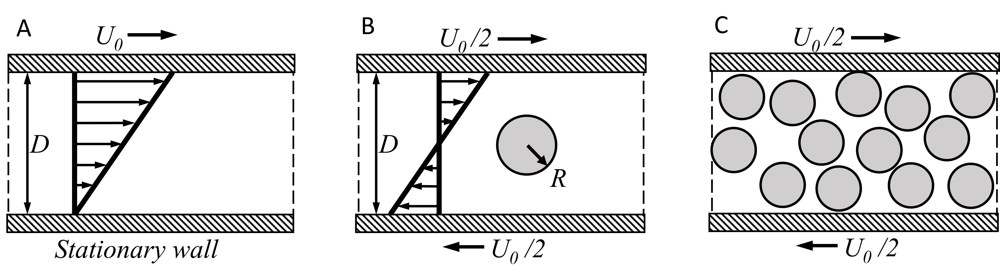

# Workshop on <kbd>Pizza3</kbd> Post-treatment

$2023-09-01$

## Goals of the workshop

In an SPH simulation in LAMMPS, information related to the state of the system at various points in time is typically stored in dump files. These files can contain data such as particle positions, velocities, and other desired mechanical quantities.

In this workshop you will learn how to manage dump file:

1. **Format**: The dump files might be in custom LAMMPS formats. You'll need to identify the format and what information is contained within the file.
2. **Reading the File**: Depending on the needs and the size of the data, you could use different tools to read the dump files, such as OVITO, VMD, or even Python or MATLAB. We developed the function `lamdumpread2()` to preprocess and read dump files (more details in documentation `lamdumpread2()`).
3. **Visualization**: For an understanding of the dynamics and qualitative analysis, you will learn how to generate plots (bead plots, fields projected onto meshes).
4. **Quantitative Analysis**: For more quantitative work, you might process the data using a custom script or other computational tools to calculate specific properties in time and space. The workshop will exemplify how to interpret trajectories, deformation fields and stresses.
5. **Special Considerations for SPH**: Since SPH is a mesh-free method for solving fluid dynamics problems, special care might be needed in the post-processing to analyze quantities that are represented in a Lagrangian frame. Analysis of pressure, viscosity, or other fluid-specific properties may require special considerations.
6. **Documenting the Results**: Using your daily tools like Markdown, you can document the analysis procedure, the results, and create a coherent report or paper. This document has been written in Matlab.

## Considered problem: case B

The case B of a suspended particle in a fluid will be considered in this workshop.

## Simulation parameters

The simulations have been carried out in 3D with the following parameters

| Parameter                                                   | Value                            | Units    | Source                                                   |
| ----------------------------------------------------------- | -------------------------------- | -------- | -------------------------------------------------------- |
| Wall velocity, $U_{wall}$                                   | $1 \times 10 ^{-3}$              | $m/s$    | set                                                      |
| Channel wall separation, $d$                                | $1 \times 10 ^{-3}$              | $m$      | set                                                      |
| Channel width, $w$                                          | $1 \times 10 ^{-3}$              | $m$      | set                                                      |
| Channel length, $l$                                         | $2 \times 10 ^{-3}$              | $m$      | set                                                      |
| Fluid dynamic viscosity, $\mu$                              | $0.04$                           | $Pa.s$   | set                                                      |
| Fluid density, $\rho$                                       | $1000$                           | $kg/m^3$ | set                                                      |
| Kinematic viscosity, $\nu$                                  | $4 \times 10 ^{-5}$              | $m^2/s$  | $\mu/\rho$                                               |
| Young’s modulus of dispersed phase, $E_{disp}$              | $10$                             | $Pa$     | Section TK                                               |
| Poisson’s ratio of dispersed phase, $\nu_{disp}$            | $0.49$                           | $-$      | Section TK                                               |
| Density of dispersed phase, $\rho_{disp}$                   | $1000$                           | $kg/m^3$ | set                                                      |
| Shear rate, $\dot{\gamma}$                                  | $10$                             | $1/s$    | $U_{wall}/d$                                             |
| Initial particle separation (cubic arrangement), $s$        | $2.08 \times 10 ^{-5}$ (3 s.f.)  | $m$      | $d/48$                                                   |
| Speed of sound, $c_0$                                       | $0.32$                           | $m/s$    | Section TK                                               |
| Hertz contact radius of fluids, $R_{Hertz}^{fluid}$         | $1.04 \times 10 ^{-5}$ (3 s.f.)  | $m$      | $s/2$                                                    |
| Hertz contact radius of wall, $R_{Hertz}^{wall}$            | $1.04 \times 10 ^{-5}$ (3 s.f.)  | $m$      | $s/2$                                                    |
| Hertz contact stiffness, $E_{Hertz}$                        | $2000$                           | $Pa$     | set                                                      |
| Critical wall penetration force, $F_{penetration}$          | $0.005$                          | $N$      | $0.24ER_{Hertz}^2$, Section TK                           |
| Area per wall particle, $A_{particle}$                      | $4.34 \times 10 ^{-10}$ (3 s.f.) | $m^2$    | $s^2$                                                    |
| Per particle friction force, $F_{friction}$                 | $1.74 \times 10 ^{-10}$ (3 s.f.) | $N$      | $\mu\dot{\gamma}A_{particle}$                            |
| Per particle normal force, $F_{normal}$                     | $3.47 \times 10 ^{-10}$ (3 s.f.) | $N$      | $F_{friction}/\mu_{friction}$, Section TK                |
| Reference density, $\rho_{0}$                               | $900$                            | $kg/m^3$ | Section TK                                               |
| Initial pressure, $P_0$                                     | $14.4$ (3 s.f.)                  | $Pa$     | Eq. TK, Section TK                                       |
| Hertz contact radius of dispersed phase, $R_{Hertz}^{disp}$ | $1.56 \times 10 ^{-5}$           | $m$      | $3s/4$                                                   |
| Hourglass coefficient, $\alpha$                             | $50$                             | $-$      | TK Ganzenmuller 2015                                     |
| Hertz Poisson’s ratio, $\nu_{Hertz}$                        | $0.25$                           | $-$      | Fixed in simulation                                      |
| Particle mass, $m$                                          | $9.04 \times 10^{-12}$           | $kg$     | $s^3\rho$                                                |
| Smoothing length, $h$                                       | $1.25 \times 10 ^{-5}$           | $m$      | TK                                                       |
| Coefficient of artificial viscosity, $q_1$                  | $30$                             | $-$      | $10\mu/h\rho c_0$                                        |
| Dimensionless relaxation time, $Fo_{relax}$                 | $0.2$                            | $-$      | set                                                      |
| CFL criteria, $\Delta t_{CFL}$                              | $3.30 \times 10 ^{-5}$ (3 s.f.)  | $s$      | $h/4c_0$                                                 |
| Viscous diffusion criteria, $\Delta t_{visc}$               | $5.43 \times 10 ^{-6}$ (3 s.f.)  | $s$      | $h^2/8\nu$                                               |
| Timestep, $\Delta t$                                        | $5 \times 10 ^{-7}$              | $s$      | $\lceil{0.1 \min(\Delta t_{CFL},\Delta t_{visc})}\rceil$ |
| Repacking time, $\tau_0$                                    | $1.04 \times 10 ^{-3}$ (3 s.f.)  | $s$      | $s/2U_{wall}$                                            |
| Repacking timesteps                                         | $3000$                           | $-$      | $1000\lceil \tau_0/1000\Delta t \rceil$                  |
| Relaxation time, $\tau_{relax}$                             | $5 \times 10 ^{-3}$ (3 s.f.)     | $s$      | $Fo_{relax} d^2 / \nu$                                   |
| Relaxation timesteps                                        | $10000$                          | $-$      | $1000\lceil \tau_{relax}/1000\Delta t \rceil$            |
| Transient time, $\tau_{transient}$                          | $0.0125$                         | $s$      | $Fo_{0.5} d^2 / \nu$                                     |
| Transient timesteps                                         | $25000$                          | $-$      | $1000\lceil \tau_{transient}/1000\Delta t \rceil$        |
| Steady-state time, $\tau_{steady-state}$                    | $0.0875$                         | $s$      | $Fo_{3.5} d^2 / \nu$                                     |
| Steady-state timesteps                                      | $175000$                         | $-$      | $1000\lceil \tau_{steady-state}/1000\Delta t \rceil$     |
| Total strain ($\gamma$)                                     | $0.55$                           | $-$      | $\dot{\gamma}t_{total}$                                  |
| Reynolds number, $Re$                                       | $0.1$                            | $-$      | $U_{wall}d/\nu$                                          |
| Elastic capillary number $Ca_e$                             | $0.119$ (3 s.f.)                 | $-$      | $2(1+\nu_{susp})\mu\dot{\gamma}/E_{susp}$                |

## Workshop File Structure

The MATLAB files and dependencies are organized under various categories as follows:

### Main File

- `example1.m`
- `example2.m`

### Main <kbd>Pizza3</kbd> Dependencies

- `lamdumpread2.m`: Swiss knife for manipulating HUGE dump files (version 2 as it is the fork for Pizza3)
- `buildVerletList.m`: Basic tool for statistical physics, implements an efficient grid search method
- `forceHertz.m`
- `forceLandshoff.m`
- `kernelSPH.m`
- `partitionVerletList.m`

### Other <kbd>Pizza3</kbd> Dependencies (used indirectly)

- `checkfiles.m`
- `forceHertzAB.m`
- `interp2SPH.m`
- `interp3SPH.m`
- `interp3SPHVerlet.m`
- `selfVerletList.m`
- `updateVerletList.m`

### Additional advanced scripts using <kbd>Pizza3</kbd>

- `KE_t.m`
- `packing.m`
- `packing_WJbranch.m`
- `packSPH.m`
- `particle_flux.m`
- `wallstress.m`

### Dependencies from <kbd>MS</kbd> <small>(INRAE/Molecular Studio)</small>

- `color_line3.m`
- `dispb.m`
- `dispf.m`
- `explore.m`
- `fileinfo.m`
- `lastdir.m`
- `MDunidrnd.m`
- `plot3D.m`
- `rootdir.m`

### DUMP FILES for EXAMPLE 1

- `dumps`
  - `hertz`
    - `dump.ulsphBulk_hertzBoundary_referenceParameterExponent+1_with1SuspendedParticle`: Original dump file
    - `PREFETCH_dump.ulsphBulk_hertzBoundary_referenceParameterExponent+1_with1SuspendedParticle`: Split folder
      - `TIMESTEP_000000000.mat`        <-------- A split file
      - `TIMESTEP_000050000.mat`        <--------158 splits (frames)
      - `TIMESTEP_000100000.mat`        <--------The values represent time
      - ...

