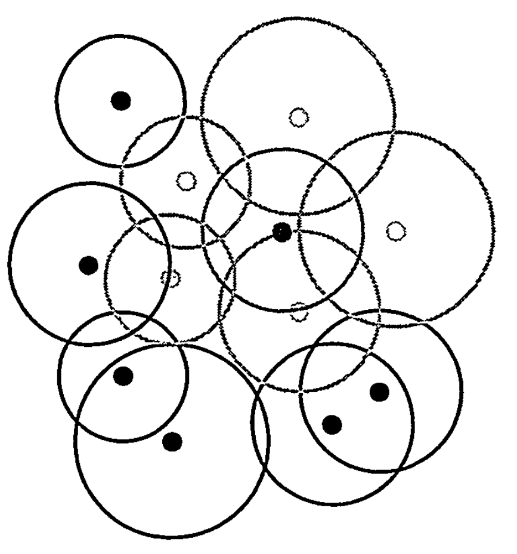
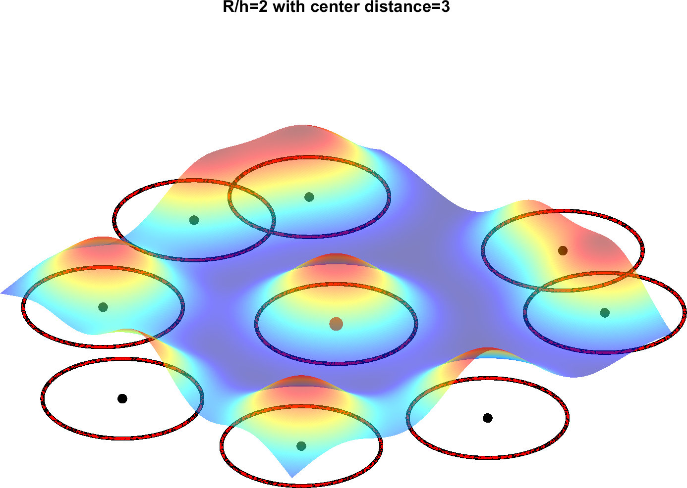
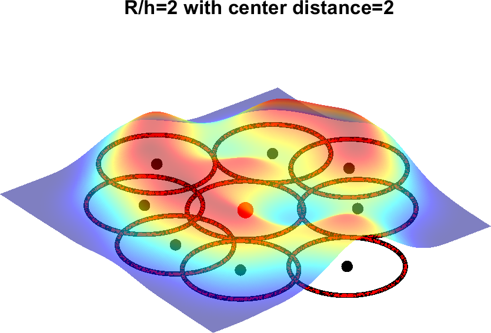

# interp3SPH()

The `interp3SPH` function performs 3D interpolation of a given field at specified query points using a kernel, often employed within Smoothed Particle Hydrodynamics (SPH). It provides functionality for spatial interpolation in three dimensions, making it adaptable for various scientific and engineering applications, particularly in fluid dynamics and materials science.

**Function Signature:**
```matlab
Vq = interp3SPH(centers, y, Xq, Yq, Zq [, W, V, forcesilent])
```

**Inputs:**
- `centers`: A `k x 3` matrix representing the coordinates of the kernel centers.
- `y`: A `k x ny` matrix containing values at `X`. If `y` is an empty matrix (`[]`), it forces a uniform density calculation.
- `Xq`: An array or matrix specifying the coordinates along the X direction for interpolation.
- `Yq`: An array or matrix specifying the coordinates along the Y direction for interpolation.
- `Zq`: An array or matrix specifying the coordinates along the Z direction for interpolation.
- `W` (Optional): A kernel function `@(r)`. The `kernelSPH()` function can be used to define a vectorized kernel.
- `V` (Optional): A `k x 1` vector of the kernel volumes. An empty matrix (`[]`) or scalar forces uniform volumes (default value = 1).
- `forcesilent` (Optional): Not specified in the description. Likely controls logging or output verbosity.

**Output:**

- `Vq`: The interpolated values at the query points `Xq, Yq, Zq`. Its dimensions are the same as `Xq`, with an additional dimension if `y` was an array.

**Examples and Usage:**

Two primary examples are provided:
1. **Interpolating a Specific Field (e.g., `x + 2*y - 3*z`):**
   - The example demonstrates how to interpolate a given field using the kernel, providing the relevant code for visualization.
   - The comparison with the standard scattered interpolation shows the flexibility of `interp3SPH`.

2. **Calculating Density between Central Bead and Closest Neighbor:**
   - A detailed example showing how to calculate the density in a system of packed particles.
   - The script helps visualize the density distribution along a specific path, demonstrating the function's utility in understanding local behavior in complex systems.

**Remarks:**
- The `interp3SPH` function is an extension of 2D interpolation to 3D space, making it suitable for volumetric data.
- By allowing uniform or variable kernel volumes, it offers flexibility for various simulation scenarios.
- The choice of kernel function and its parameters significantly affect the behavior and accuracy of the interpolation.

**Related Functions:**
- `interp2SPH`: 2D interpolation using SPH kernels.
- `kernelSPH`: Kernel function generation for SPH.
- `packSPH`: A function likely related to packing SPH particles, though not detailed in the provided description.


### Example 1: Interpolating the Field  $x + 2y - 3z$

This example demonstrates how to interpolate the field given by the equation \( x + 2y - 3z \) using the `interp3SPH` function.

**Code Snippet:**
```matlab
r = 0.5;
h = 2*r;
XYZ = packSPH(5,r);
W = kernelSPH(h,'lucy',3);
y = XYZ*[1;2;-3]; % arbitrary field to be interpolated x+2*y-3*z
nresolution = 50;
xg = linspace(min(XYZ(:,1))-h,max(XYZ(:,1))+h,nresolution);
yg = linspace(min(XYZ(:,2))-h,max(XYZ(:,2))+h,nresolution);
zg = linspace(min(XYZ(:,3))-h,max(XYZ(:,3))+h,nresolution);
[Xg,Yg,Zg] = meshgrid(xg,yg,zg);
Vg = interp3SPH(XYZ,y,Xg,Yg,Zg,W);
figure, hs= slice(Xg,Yg,Zg,Vg,1:3,1:3,[]); set(hs,'edgecolor','none','facealpha',0.5), axis equal
% comparison with standard scattered interpolation
F = scatteredInterpolant(XYZ(:,1),XYZ(:,2),XYZ(:,3),y);
Vg = F(Xg,Yg,Zg);
figure, hs= slice(Xg,Yg,Zg,Vg,1:3,1:3,[]); set(hs,'edgecolor','none','facealpha',0.5), axis equal
```

**Explanation:**
- `r` and `h` define the radius and smoothing length of the kernel.
- `XYZ` represents the packed coordinates generated by the `packSPH` function.
- The kernel function `W` is obtained using `kernelSPH`.
- `y` represents the values of the field at the centers.
- The function then sets up the grid `Xg`, `Yg`, and `Zg` to interpolate the field.
- `interp3SPH` interpolates the field using the SPH kernel.
- Finally, the interpolated values are visualized using MATLAB's slice plot, and the result is compared to the standard scattered interpolation.

### Example 2: Calculating Density between the Central Bead and Its Closest Neighbor

This example calculates the density along a line connecting the central bead with its closest neighbor in a packed SPH system.

**Code Snippet:**
```matlab
r = 0.5;
h = 2*r;
XYZ = packSPH(5,r);
W = kernelSPH(h,'lucy',3);
[~,icentral] = min(sum((XYZ-mean(XYZ)).^2,2));
dcentral = sqrt(sum((XYZ-XYZ(icentral,:)).^2,2));
icontact = find( (dcentral>=2*r-0.0001) & (dcentral<=2*r+0.0001) );
[~,closest] = min(dcentral(icontact));
icontact = icontact(closest);
reducedcurvilinear = linspace(-2.5,2.5,100)';
curvilinear = reducedcurvilinear*norm(XYZ(icontact,:)-XYZ(icentral,:));
XYZg = XYZ(icentral,:) + reducedcurvilinear*(XYZ(icontact,:)-XYZ(icentral,:));
Vg = interp3SPH(XYZ,[],XYZg(:,1),XYZg(:,2),XYZg(:,3),W);
figure, plot(curvilinear,Vg), xlabel('distance to the central bead'), ylabel('density')
```

**Explanation:**
- The setup is similar to the first example with radius, smoothing length, and kernel function definition.
- The central bead is identified, and the closest neighbor is found based on distance.
- The function calculates the density along a line connecting the central bead and its closest neighbor.
- The density is then interpolated using the `interp3SPH` function.
- Finally, the density distribution is plotted against the curvilinear distance to the central bead.

These examples provide insights into the diverse applications of the `interp3SPH` function. The first example showcases general interpolation capabilities, while the second highlights the utility for specific density calculations within a particle system. Both serve as a robust demonstration of the function's practical utility in simulating and analyzing complex systems in three dimensions.


## THEORY

### Considered <kbd>SPH</kbd> techniques in the project <kbd>MOUTHFEEL</kbd>

#### 1.  Approximation of averages on spatially distributed kernels

Unlike other MD-like methods, particles in <kbd>SPH</kbd> have a known mass but not a predefined volume or radius. This feature was very appealing for the first interstellar representation of gases submitted to strong density fluctuations. Particles are typically "*dots*" with different physical properties such as position, velocity, density, pressure, internal energy, and more. These quantities are distributed radially in space according to Gaussian-like smoothing kernels with finite support, as shown in **Figure 8a**. The same way, any function $A\left(\mathbf{r}\right)$ defined over a volume $\Omega$ can be written as the superposition of delta functions $\delta\left(\mathbf{r}-\mathbf{r'}\right)$:
$$
A\left(\mathbf{r}\right)=\iiint_\Omega A\left(\mathbf{r'}\right)\delta\left(\mathbf{r}-\mathbf{r'}\right)dr'
$$
the volume average of $\left<A\right>$ can be approximated over a set of radial basis functions (kernels) $W\left(\lvert \mathbf{r}-\mathbf{r'}\rvert,h\right)$ approaching $\delta\left(\mathbf{r}-\mathbf{r'}\right)$ when the width of the kernel $h\to0$:
$$
\left<A\left(\mathbf{r}\right)\right>=\iiint_\Omega A\left(\mathbf{r'}\right)W\left(\lvert \mathbf{r}-\mathbf{r'}\rvert,h\right)dr'\approx\sum_j\frac{m_j}{\rho(\mathbf{r'_j})}A(\mathbf{r'_j})W\left(\lvert \mathbf{r}-\mathbf{r'_j}\rvert,h\right)
$$
where $\sum_j$ represents the summation over all particles $j$ with volume $\frac{m_j}{\rho(\mathbf{r'_j})}$ and located at positions $\mathbf{r'_j}$ within the volume of interest $\Omega$ (usually a neighborhood around the position $\mathbf{r}$).


| (a) mixture of particles                                     | (b) $\frac{R}{h}=0.5$, $\frac{\left<r\right>}{R}=3$          | $(c) \frac{R}{h}=0.5$, $\frac{\left<r\right>}{R}=2$          |
| ------------------------------------------------------------ | ------------------------------------------------------------ | ------------------------------------------------------------ |
|  |  |  |

**Figure 8**. Approximation of a field (scalar or vectorial) with radial basis functions, so-called kernels: (a) Illustration of the overlaps of the kernel supports (circles) of many particles in a mixture. The neighbors of the dark particle in the NE direction are shown in white; (b) Visualization of 8 interacting kernels (smoothing length $h$) corresponding to identical particles of radius $R$ and distributed around a central one at an average distance $\left<r\right>=3R$; (b) Idem with a distance of $2R$.


> ⚠️**COMMON ISSUES**
>
> The definition of particle volume as $\frac{m_i}{\rho_i}$ may be a source of inconsistency in the presence of random packing as the particles may do not fully partition the total volume and the integration cannot reproduce a uniform field [[LIT2015](#XXXXSPH09)]. Convergence is, however, asymptotically restored only when the number of particles become infinite $N\to\infty$ and $h\to 0$. From a physical point of view, too small <kbd>SPH</kbd> particles should be replaced by <kbd>DPD</kbd> or <kbd>SDPD</kbd> ones incorporating thermal fluctuations capable of sampling with more accuracy the accessible space. 


#### 2. The residual error on the gradient of averaged quantities

As commented in Ref. [[MON1983](#XXXXSPH07)] (see Eq. 2. herein and also Eq. $\ref{symder}$), the average gradient reads:
$$
\left<\nabla A\left(\mathbf{r}\right)\right>=\nabla \left<A\left(\mathbf{r}\right)\right>+\iint_{\partial\Omega}A\left(\mathbf{r'}\right)W\left(\lvert \mathbf{r}-\mathbf{r'}\rvert,h\right)\mathbf{n}da
\label{graderr}
$$
The approximation of $\left<\nabla A\left(\mathbf{r}\right)\right>$ by $\nabla\left<A\left(\mathbf{r}\right)\right>$ requires a sufficiently large volume $\Omega$, so that the value of the kernel $W\left(\lvert \mathbf{r}-\mathbf{r'}\rvert,h\right)$ vanishes at its boundary surface $\partial\Omega$. In other words, the gradient is correctly estimated only for distances larger than particles. Close to boundaries or particles of different types, gradients (no-slip condition) are poorly enforced. As a rule of thumb and quoting [[MON2005](#XXXXSPH03)], it should remember " *spatial derivatives sit uncomfortably with particle methods for which time derivatives are more natural*".